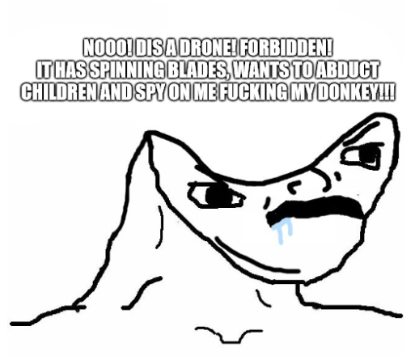

# Einsteigerguide FPV (Ende 2021)

**WORK IN PROGRESS!!!**

<!-- TOC -->

- [Einleitung](#einleitung)
- [SUPER-SHORT-CUT-FÜR-MEGA-UNGEDULDIGE](#super-short-cut-f%C3%BCr-mega-ungeduldige)
- [Einkaufen](#einkaufen)
  - [China-Shops](#china-shops)
  - [Europäische Shops](#europ%C3%A4ische-shops)
  - [EBay Kleinanzeigen](#ebay-kleinanzeigen)
- [Fernbedienung](#fernbedienung)
  - [Formfaktor](#formfaktor)
  - [Modi](#modi)
  - [Funkprotokoll](#funkprotokoll)
  - [Empfehlungen Funke](#empfehlungen-funke)
- [Simulatoren](#simulatoren)
- [Videosystem](#videosystem)
  - [Allgemein](#allgemein)
  - [Analog](#analog)
  - [DJI](#dji)
  - [SharkByte / HDZero](#sharkbyte--hdzero)
  - [OpenHD](#openhd)
  - [HD Aufnahmen](#hd-aufnahmen)
- [Flugmodi](#flugmodi)
  - [Cinematic](#cinematic)
  - [Race](#race)
  - [Freestyle](#freestyle)
  - [Longrange](#longrange)
- [Drohne / Quad / Copter](#drohne--quad--copter)
  - [Klassen](#klassen)
  - [Komponenten](#komponenten)
- [Software Funkfernbedienung](#software-funkfernbedienung)
  - [OpenTX](#opentx)
  - [EdgeTX](#edgetx)
  - [FreedomTX](#freedomtx)
- [Software Flight Controller](#software-flight-controller)
  - [Betaflight](#betaflight)
  - [KISS / FETtec](#kiss--fettec)
  - [Emuflight](#emuflight)
  - [iNAV](#inav)
  - [Ardupilot](#ardupilot)
- [Akkus](#akkus)
  - [Akku-Aufbau](#akku-aufbau)
  - [Sicherheit](#sicherheit)
  - [Ladegeräte](#ladeger%C3%A4te)
  - [paralleles Laden](#paralleles-laden)
- [Drohne Teil 2](#drohne-teil-2)
  - [Fertige Drohne kaufen](#fertige-drohne-kaufen)
  - [Eigenbau](#eigenbau)
  - [Build on Demand](#build-on-demand)
- [Zusatzausrüstung](#zusatzausr%C3%BCstung)
  - [Bit-Set](#bit-set)
  - [Löten](#l%C3%B6ten)
  - [Drohnenrucksack](#drohnenrucksack)
- [Rechtliches](#rechtliches)
  - [Führerscheine](#f%C3%BChrerscheine)
  - [Vereine](#vereine)
- [D-Druck](#d-druck)
  - [Drucker](#drucker)
  - [Materialien](#materialien)
- [Jenseits der Drohne](#jenseits-der-drohne)
- [Glossar](#glossar)
- [Linkliste](#linkliste)
  - [Youtube-Channel](#youtube-channel)
  - [Websites](#websites)
  - [Discord Server](#discord-server)
  - [OpenSource Projekte](#opensource-projekte)
  - [Hersteller Dokumentationen](#hersteller-dokumentationen)
- [Sonstiges](#sonstiges)
  - [Puffis gesammelte Weisheiten](#puffis-gesammelte-weisheiten)

<!-- /TOC -->

## Einleitung

Dieser Guide soll einen umfangreichen Einblick in das Thema "FPV-Drohnen" vermitteln und hat den Anspruch, die meisten *allgemeinen* Fragen zu beantworten über die ein Neueinsteiger stolpern könnte.

Vorweg: Das Hobby kann teuer sein. Plane mit mindestens 500€ für einen absoluten Einsteiger-Setup oder 1000-1500€ für ein gutes Setup.

Das Dokument hat eine ziemliche Länge, daher hat der liebe *remove_me* das in seiner unnachahmlichen Art kurz gefasst.

## SUPER-SHORT-CUT-FÜR-MEGA-UNGEDULDIGE

- **Schritt 1**: Kaufe eine Funke (TX16s oder Jumper T-Lite).
- **Schritt 2**: Kaufe einen Simulator (Steam: Liftoff oder Velocidrone).
- **Schritt 3**: übe übe übe - stundenlang und informiere dich nebenher langsam weiter.
- **Schritt 3.1**: Lies den Rest in diesem Dokument. Kläre Fragen und werde schlauer.
- **Schritt 4**: Kaufe weitere Hardware, entweder einen Fertig-Copter (BNF) oder aber Einzelteile.
- **Schritt 4.1**: Ein Ladegerät (ISDT 608AC oder Hota D6 Pro).
- **Schritt 4.2**: Passende Akkus für die Drohne (4 Stück sollten es schon sein).
- **Schritt 5**: übe übe übe - bis alles da ist.
- **Schritt 6**: rausgehen - fliegen.

## Einkaufen

In dem Abschnitt gehe ich kurz darauf ein, wie du überhaupt an Drohnen und Zubehör kommst.

### China-Shops

Hardware rund um Drohnen wird fast ausschließlich in China gefertigt.

Am günstigsten kommt man an die Produkte, wenn man auch direkt dort einkauft.

Vorteil beim Einkaufen in China: Günstiger.
Nachteil: Du wartest 10-30 Tage bis die Sachen da sind.

Es gibt auch Express-Versand, da sind die Sachen dann in ~5 Tagen da, aber der kostet mehr.
Und es bleibt öfter im Zoll hängen. Dann kannst du auch gleich in Deutschland kaufen.

#### Banggood und Aliexpress

Bekannte Shops sind [Banggood](https://www.banggood.com/) und [Aliexpress](https://de.aliexpress.com/).

[Banggood](https://www.banggood.com/) ist eher mit Amazon zu vergleichen. Versand und Support liegt beides bei Banggood und zumindest in den letzten Jahren leistet sich Banggood auch einen ganz ordentlichen Support. Zudem unterhält es kleinere Lagerhäuser in Europa über die vereinzelte Produkte schneller geliefert werden können.

[Aliexpress](https://de.aliexpress.com/) ist vergleichbar mit Ebay - eine Handelsplattform.
Unterschiedliche Händler übernehmen unabhängig von Aliexpress den Versand und Support für die Produkte. Hit or miss, man kann auch daneben greifen und einen Händler mit unterirdischem Support erwischen. Dafür kann man auch günstiger weg kommen als bei Banggood.

Beide Shops führen Einfuhrumsatzsteuer und Zoll direkt ab. Oder schlagen sie drauf und umgehen den Zoll auf irgendwelchen Wegen.

> *Anm. remove_me*: Du magst Glücksspiel und hast kein Problem mit Wartezeiten? Banggood it is!

#### Direktvertrieb

Bekannte FPV-Marken wie [Diatone](https://www.diatone.us/), [iFlight](https://iflight-rc.com) etc. haben auch ihre eigenen Shops.

Manchmal kommt man auch da bei Rabattaktionen günstig an Hardware.

Anders als Banggood und Aliexpress führen diese Shops Einfuhrumsatzsteuer und Zoll nicht direkt ab. Du musst hier also nochmal ~20% auf die Bestellung drauf rechnen und es kann ein Gang zum nächsten Zollamt oder zur Poststelle notwendig sein. Manchmal hat man aber auch Glück.

### Europäische Shops

Eine Liste innereuropäischer FPV-Shops findest du [hier](https://fpvmarket.eu/european-fpv-stores/).

Die großen einschlägigen deutschen Shops über die du immer wieder stolperst sind:

- [n-factory.de](https://n-factory.de/)
- [shop.rc-hangar15.de](https://shop.rc-hangar15.de/)
- [rctech.de](https://www.rctech.de/)
- [fpv24.com](https://www.fpv24.com/de/)
- ...

### EBay Kleinanzeigen

Hier lohnt es die Augen offen zu halten.
Es gibt immer wieder Schnäppchen z.B. bei aufgelösten Sammlungen. Gerade wenn es auf den Winter zu geht, verkaufen die Schönwetterflieger ihre Sachen.

Wenn du mit dem Guide durch bist, kannst du viele Sachen auch ganz gut einschätzen.
Meist braucht man für gute Käufe etwas Erfahrung...

Gerne kannst du auch Rückfragen dazu im [pr0 Discord](https://discord.gg/uBh3QsnqF5) stellen.

## Fernbedienung

Du willst fliegen? **Nein**, willst du nicht.

Du willst erst mal im Simulator üben.

> *Anm. remove_me*: **GLAUB ALLEN! ERST SIMULATOR! DANN DROHNE!!**

Wenn du ein Gamepad hast, kannst du direkt dir auf Steam einen der vielen Simulatoren holen. Ein Gamepad ist besser als nichts, aber eigentlich willst du eine echte Funkfernbedienung. Diese verhält sich von den Sticks anders als ein Gamepad.

Moderne Funkfernbedienungen kannst du an deinen Rechner anschließen und dort als Controller verwenden.

Für diesen Abschnitt kannst du zwischen 90 und 250€ einplanen. Eine Funkfernbedienung ist normalerweise eine einmalige Anschaffung, die dich sehr lange begleiten wird.

### Formfaktor

Als vorherrschende Formfaktoren bei Fernbedienungen gibt es Gamepad und Vollformat. Gamepad sollte bekannt sein. Vollformat sind viereckige Kästen!

Nachfolgend 2 populäre Vertreter beider Formfaktoren.

| Vollformat | Gamepad |
| -------- | -------- |
|  |  |

### Modi

Bei einem Gamepad zentrieren sich beide Analog-Sticks. Bei einer RC-Funkfernbedienung zentriert sich die Achse des Sticks, auf dem das Gas liegt nicht selbständig, damit du dieses feiner dosieren kannst.

Welche Achse genau das ist, hängt vom Modus ab, auf den deine Funkfernbedienung eingestellt ist. Der gängigste Modus ist "Mode 2", aber nimm, womit du am besten klar kommst. Für den Wechsel zwischen "Mode 1/3" und "Mode 2/4" müssen mechanische Anpassungen in der Funke vorgenommen werden, damit die Gas-Achse nicht mehr zentriert wird.

### Funkprotokoll

Neben dem Formfaktor ist auch noch die Frage nach dem Funkprotokoll. Sender und Empfänger müssen die gleiche Sprache sprechen. Üblicherweise entscheidet man sich für einen Sender, der das gewünschte Protokoll unterstützt und packt dann dazu passende Empfänger in die Drohne.

Funkprotokolle verwenden die Frequenzen 2.4Ghz und 900Mhz.

900Mhz hat eine höhere Reichweite/bessere Penetration, wenn du hinter Bäumen oder in Gebäuden fliegst. 2.4Ghz erlaubt mehr Piloten gleichzeitig in der Luft und hat eine höhere Update-Rate, heißt, deine Eingaben werden häufiger zur Drohne geschickt.

Falls du ein nicht von deiner Funke abgedecktes Protokoll fliegen willst, kannst du dieses mit Modulen nachrüsten. Die beiden Formfaktoren nutzen unterschiedliche Modulgrößen, "JR" bei Vollformat, "Lite" bei Gamepad.

Zudem unterscheide ich bei den Funkprotokollen zwischen Legacy und Modern.

#### Legacy

Diese Protokolle sind irrelevant.
FrSky, Graupner und wie sie alle heißen. Ihnen gemein ist, dass sie eigentlich alle mit einem Multi-Protokoll-Modul abgedeckt werden. Vergiss sie. Wenn du welche hast, verkaufe sie.

Wenn du unbedingt eine Drohne fliegen willst, die einen Empfänger mit einem dieser Protokolle verwendet, ist ein Multi-Protokoll-Modul der richtige Weg.

#### Modern

Bei den modernen Übertragungsprotokollen ist die Frequenz nahezu irrelevant. Außer um wirklich die letzten Prozent beim Rennen fliegen raus zu kitzeln, wirst du die höhere Übertragungsfrequenz bei 2.4 Ghz nicht spüren. Ähnlich verhält es sich bei der höheren Reichweite von 900Mhz. Beide Frequenzen gehen mit den modernen Protokollen weiter als deine Videoverbindung.

- TBS Crossfire (900Mhz)
- TBS Tracer (2.4Ghz)
- ELRS (900Mhz und 2.4Ghz)
- ImmersionRC Ghost (2.4Ghz)

TBS Crossfire ist das älteste und ausgereifteste der 4 Systeme. Lange Zeit das einzige ernstzunehmende Protokoll, mit dem man auch fertige Drohnen bekommen hat. Die TBS Tango 2 hat Crossfire bereits eingebaut. Es gibt kombinierte Empfänger/(analoge) Videosender, die eine komfortable Steuerung des Videosenders über Crossfire erlauben. TBS stellt auch analoge Videosender und Empfänger her. Wenn man sich darauf einlässt, bietet es eine umfangreiche Integration. Für das System wirst du online umfangreiche Hilfestellungen finden.

TBS Tracer ist wie Crossfire nur auf 2.4Ghz. Die TBS Mambo hat Tracer bereits eingebaut. Alles andere funktioniert wie bei Crossfire.

ELRS ist OpenSource und wird von unterschiedlichen Herstellern angeboten.
Es gibt Sender/Empfänger für 2.4Ghz und 900Mhz. Sender und Empfänger müssen zusammen passen, sie können von unterschiedlichen Herstellern kommen, müssen aber die gleiche Frequenz nutzen. Das System ist noch relativ jung, aber es springen zunehmend Hersteller auf den Zug auf. Es gibt inzwischen auch vereinzelt Drohnen fertig damit zu kaufen. Das günstigste der 4 Systeme.

Ghost bietet eine ähnliche Kombination aus Funkempfänger und Videosender wie Crossfire und Tracer. Ist in meiner Warnehmung nicht so weit verbreitet, entsprechend kann man bei Problemen etwas weniger auf Hilfestellung aus der Community zählen.

### Empfehlungen (Funke)

Wenn du dir eine Funkfernbedienung holst, solltest du darauf achten, dass diese mit OpenTX oder einem Derivat davon läuft.

OpenTX ist ein Betriebssystem für Funkfernbedienungen und hat sich bei FPV-Drohnen als Quasi-Standard etabliert. Für Funken mit diesem Betriebssystem wirst du online jede Menge Hilfestellungen finden.

Alle hier genannten Funkfernsteuerungen verwenden entweder OpenTX oder ein Derivat davon, z.B. FreedomTX oder EdgeTX.

> *Anm. rumpelst1lzk1n*: Funken ohne OpenTX (oder Derivat davon) sind irrelevant.

Bei den genannten Funken ist das Display nachrangig.
Wir fliegen FPV (First-Person-View) und bekommen die relevanten Flugdaten in der Brille angezeigt. Ein großes Display wie bei der TX16S ist zwar schön, wenn man etwas umfangreicher konfigurieren will, aber man kann die Funken auch über den Rechner ganz ohne Display konfigurieren.

#### Radiomaster TX16S

- ca. 200€
- Vollformat
- eingebautes Multi-Protokoll-Modul
- OpenTX oder EdgeTX
- großer farbiger Touchscreen, Touch wird nur in EdgeTX unterstützt

Gibt es auch als Variante von Eachine. Beide Funken sind gleichwertig und unterscheiden sich nur geringfügig durch die Positionierung und Form einiger Knöpfe.

#### Radiomater TX12

- ca. 90€
- etwas kleiner als Vollformat
- eingebautes Multi-Protokoll-Modul
- OpenTX oder EdgeTX
- Monochrom-Display

#### Jumper T-Lite

- ca. 90€
- Gamepad
- eingebautes Multi-Protokoll-Modul
- winziges Monochrom-Display

#### TBS Tango 2

- ca. 160-200€
- Gamepad
- eingebautes Crossfire
- ständig ausverkauft
- winziges Monochrom-Display
- Multi-Protokoll-Modul muss nach gekauft werden

#### TBS Mambo

- ca. 150€
- etwas kleiner als Vollformat
- eingebautes Tracer
- kleines Monochrom-Display

## Simulatoren

Für den Einstieg erfüllt jeder Simulator den Zweck dass du dich mit der Steuerung einer Drohne vertraut machst. Und die Drohne gegen Bäume, Häuser und in den Asphalt hämmern kannst, ohne gleich Geld in die Reparatur stecken zu müssen.

Und falls du feststellst, dass das Hobby überhaupt nichts für dich ist, hast du nur Geld für die Fernbedienung ausgegeben. Diese kannst du normalerweise ohne großen Verlust auf eBay-Kleinanzeigen oder in einschlägigen Facebook-Gruppen verkaufen.

Hier eine Liste populärer Simulatoren (ohne Wertung):

- [Orqa FPV.SkyDive (Steam, kostenlos)](https://store.steampowered.com/app/1278060/Orqa_FPVSkyDive/)
- [Velocidrone (NICHT auf Steam erhältlich, Quasi-Standard für Racer)](https://www.velocidrone.com/)
- [Liftoff (Steam, std. für alles andere)](https://store.steampowered.com/app/410340/Liftoff_FPV_Drone_Racing/)
- [DRL (Steam)](https://store.steampowered.com/app/641780/The_Drone_Racing_League_Simulator/)
- [Uncrashed (Steam)](https://store.steampowered.com/app/1682970/Uncrashed__FPV_Drone_Simulator/)
- [AI Drone Simulator (Steam)](https://store.steampowered.com/app/1608560/AI_Drone_Simulator/)

## Videosystem

Für die Auswahl einer Videobrille muss man sich bewusst machen, welche Systeme es gibt.

Die Auswahl des Videosystems bestimmt die Auswahl der FPV-Brille und der Videosender. Gerade die Brille ist mit der größte Kostenfaktor beim Einstieg. Für diesen Abschnitt kannst du zwischen 110€ für einen ganz rudimentären und 800€ für einen Premium-Setup einplanen.

### Allgemein

FPV unterscheidet sich von klassischem Modellbau-Flug dadurch, dass du von deinem Fluggerät das Live-Videobild an einen Empfänger überträgst und somit eine Art Pilotenansicht hast. Die Wiedergabe kann dabei auf einem Monitor oder einer Videobrille erfolgen. Wir konzentrieren uns im nachfolgenden auf den Empfang mittels Videobrille.

In der Videobrille hast du normalerweise einen Empfänger, entweder fest verbaut oder als Modul. Zudem hast du in der Brille die Möglichkeit, das angezeigte Bild auf SD-Karte aufzunehmen. Stichwort `DVR`. **NUTZE ES!** Die Bildqualität eignet sich eher nicht zum Angeben auf Youtube. Aber wenn du deine Drohne irgendwo auf weiter Flur verloren hast, wirst du die Möglichkeit zu schätzen wissen, dass du den Flug rekonstruieren kannst und weißt, wo das Gerät abgestürzt ist.

#### Frequenz und Kanal

Die Videosender der nachfolgenden Systeme arbeiten alle auf 5.8Ghz. Auf diesem Frequenzband funkt auch haushaltsübliches WLAN. Wenn du in der Nähe eines WLAN-Access-Punkts fliegst kann es sein, dass dieser dein Videosignal stört.

Je nach Funksystem gibt es mehrere Kanäle (Channel). Sender und Empfänger müssen auf den gleichen Kanal eingestellt sein. Die Kanäle sind in Gruppen eingeteilt. Die Kanäle der gleichen Gruppe können üblicherweise parallel verwendet werden, ohne dass sich diese zu stark negativ beeinträchtigen.

Wenn du vermutest, dass dein Videosignal von WLAN gestört wird, kann es sich lohnen den Kanal zu wechseln.

"R" (Raceband) ist die beliebteste Kanal-Gruppe für den Flug mit mehreren anderen Piloten. Wenn du zusammen mit anderen Piloten fliegst, solltet ihr vorab ausmachen, wer welchen Kanal verwendet und das auch **vor** dem Abheben verifizieren.

Beim Anschalten des Videosenders kann dieser auch auf anderen als den ausgewählten Frequenzen senden. Vermeide es daher, deinen Videosender in unmittelbarer Nähe von anderen Piloten einzuschalten.

Nicht alle einstellbaren Frequenzen sind in Europa legal. Welche legal geflogen werden dürfen, kannst der Grafik oben entnehmen.

#### Sendeleistung

Die Sendeleistung wird üblicherweise in Milliwatt (mw) angegeben.

In Europa beträgt die maximal zulässige Sendeleistung 25mw. Es gibt auch Videosender, die ein vielfaches davon unterstützen, die meisten erhältlichen Sender unterstützen bis zu 200, 400, 600 oder 1000mw. Mehr Leistung heißt mehr Reichweite und besseres Bild auf größere Distanz. Um die Reichweite zu verdoppeln, musst du die Leistung vervierfachen.

Die Sendeleistung lässt herunter regeln, meistens erfolgt das über die Steuersoftware der Drohne.

Es obliegt dem Piloten, die gesetzlich vorgeschriebene Leistung einzuhalten.

> *Anm. rumpelst1lzk1n*: Sind wir mal ehrlich: Die wenigsten halten sich daran, insbesondere dann, wenn sie alleine unterwegs sind.

Je höher die Sendeleistung, desto höher strahlst du auch in benachbarte Frequenzen. Bei FPV-Rennen wird daher üblicherweise 25mw vorgeschrieben, damit sich die Piloten nicht gegenseitig beeinträchtigen. Daran hält man sich auch!

Betreibe den Videosender **NIEMALS** ohne Antenne. Andernfalls kann die Energie aus dem Sender nicht in Funkwellen umgesetzt werden und der Sender stirbt den Hitzetod. Bleibende Schäden an der Hardware bis hin zum vollständigen Defekt nicht ausgeschlossen.

#### Antennen

Bei Antennen unterscheidet man zwischen 3 Typen:

- Dipol
- RHCP
- LHCP

Wenn du auf einer Seite (z.B. des Senders) einen Dipol verwendest, ist es relativ egal, was du auf der anderen Seite (z.B. des Empfängers) hast.

Verwendest du `RHCP` oder `LHCP`, so solltest du aufpassen, dass dies sowohl auf Sende- wie auch auf Empfangsseite der Fall ist.

Zudem unterscheidet man zwischen gerichteten und ungerichteten Antennen.

Für den Einstieg sind auf Brille und Drohne ungerichtete Antennen vom Typ "Lollipop", "Stubby" oder "Pagoda" zu bevorzugen.

Bei sehr kleinen und leichten Drohnen (TinyWhoops, siehe unten) kann aus Gewichtsgründen auch ein Dipol Sinn machen.

| dipol | lollipop | stubby | pagoda |
|----- | -------- | -------- | -------- |
|  | |  |  |

Eine gute Antenne kann mehr zu einem stabilen Bild beitragen, als einfach die Leistung des Senders zu erhöhen.

### Analog

Bis vor 2 Jahren die einzige Möglichkeit für FPV. Es gibt dutzende verschiedene Kameras, Videosender und Brillen von mehreren Herstellern. Alles untereinander kompatibel.

Die mit großem Abstand günstigste Möglichkeit, in FPV einzusteigen. Wenn dein Budget auf die oben erwähnten 500€ beschränkt ist, ist das hier deine Kategorie.

Brille 80€, Videosender 10€, Kamera 15€ wäre so ein Minimal-Setup.

Neben dem Geld ist auch noch das Gewicht ein Argument für einen Analog-Setup. Die leichtesten anlogen Videosender wiegen circa 1 Gramm.

#### Videosender

Es gibt eine Vielzahl unterschiedlicher Videosendern von unterschiedlichen Herstellern.

Üblich sind zwischen 200mw und 600mw maximaler Sendeleistung.
Es gibt noch deutlich stärkere Sender bis hoch zu 2000mw, diese sind aber erst für wirklich große Distanzen relevant.

Der Vorteil bei analogen Systemen ist, dass du die unterschiedlichen Videosender leicht gegeneinander austauschen kannst.

Besonders hervorzuheben sind die Videosender der Unify-Reihe von TBS und die ImmersionRC Tramp. Sie gelten mit als die Besten.

Für den Anfang tut es eigentlich jeder, aber spätestens wenn du mit anderen fliegst, willst du einen halbwegs guten. Manche No-Name-VTX haben ein sehr "unsauberes" Signal und streut auch über den eigentlich eingestellten Kanal hinaus in andere Frequenzen. Wenn das Budget wirklich knapp ist und du den billigsten VTX willst, achte zumindest darauf, dass dieser mit [OpenVTX](https://github.com/OpenVTx/OpenVTx) als Firmware beworben wird.

#### Brille

Bei den Analog-Brillen gibt es die größte Varianz in Sachen Preis. Es gibt Brillen für ~40€ und für 600€.

Man unterscheidet bei den Brillen zwischen Box- und Binocular-Style.

| Box | Binocular |
| -------- | -------- |
|  |  |

##### Box-Style

Box-Style ist einfach nur eine Box, die vor dem Gesicht hängt. Je nach Bauform mehr oder weniger unförmig. Die Box ein Display und ggf noch eine Linse.

Vorteile:

- günstiger
- leichter mit Brille nutzbar

In dieser Kategorie bekommst du ab ca ~80€ eine halbwegs taugliche Einsteigerbrille.

##### Binocular-Style

Beim Binocular-Style hast du ein Display pro Auge. Brillen in dieser Bauform sind deutlich kompakter aber auch deutlich teurer.

Eine Brille passt da eher selten drunter, dafür kannst du oft den Augenabstand und die Dioptrien in der Optik der Brille direkt einstellen.

Vorteile:

- kleiner/leichter
- Optik pro Auge anpassbar

In dieser Kategorie bekommst du ab ca ~350€ eine halbwegs taugliche Brille.  Lass dich nicht täuschen, es gibt günstigere Brillen im Binocular-Style. Die sind Müll.

##### Empfehlungen (Analog-Brillen)

Schau dich auf dem Gebrauchtmarkt um. Viele der unten genannten Modelle kriegst du auf eBay-Kleinanzeigen recht günstig gebraucht.

###### Eachine EV800D

Empfehlung des Hauses als absolute Einsteiger-Brille, für die es sich lohnt, Geld auszugeben.

- ca. 80€
- DVR
- Antennen-Diversity
- wird mit einer Patch und einer Omni-Antenne geliefert
- integriertes Receiver mit Diversity, was in dieser Preisklasse nicht selbstverständlich ist

###### Skyzone Cobra X (v2)

- ca. 250€
- gutes DVR (v2 hat 60FPS)
- gutes eingebautes Receiver-Modul
- HDMI-in

###### Fatshark Attitude V6

- ca 350-400€
- DVR
- integrierter Receiver
- HDMI-in

###### Fatshark Dominator HDO 2

- ca. 600€
- DVR
- **KEIN** Receiver
- HDMI-in
- OLED-Display (knackscharfe Farben)

Auf dem Gebrauchtmarkt gibt es öfter auch Pakete mit Receiver.

###### Skyzone Sky04X (v2)

- ca. 600€
- gutes DVR, 60FPS
- gutes eingebautes Receiver-Modul
- HDMI-in
- OLED-Display (knackscharfe Farben)

#### Empfänger

Manche Brillen kommen ohne Empfänger. Hier musst du den diesen über einen Modulschacht nachrüsten.

Falls du dich für so eine Brille entschieden hast, hier eine Liste populärer Empfänger:

- TBS Fusion (siehe Artikel zu TBS Crossfire/TBS Tracer)
- Rapidfire
- FuriousFPV Achilles

Ein Empfänger sollte ähnlich wie eine Brille mit eingebautem Modul mindestens über 2 Antennen verfügen. Damit kann sich der Empfänger das beste Signal heraus picken (`Diversity`). Fortgeschrittene Module wie TBS Fusion oder Rapidfire können das Signal beider Antennen kombinieren und ein optimales Bildsignal herausrechnen.

### DJI

DJI ist das Apple unter den FPV-Systemen. Funktioniert super, ist aber ein goldener Käfig. Kameras gibt es von 2 Herstellern. Es gibt 2 Brillen und 2 Videosender von DJI.

> *Anm. remove_me*: Das Bild ist dafür auch circa 10x geiler und kommt so in etwa bei 720p raus.

#### Brillen

Bei den Brillen unterscheidet man zwischen V1 und V2. V2 ist nur relevant, wenn du die DJI-FPV-Drohne fliegen willst. Sonst tut es V1 auch. Die DJI-FPV-Drohne ist eine glorifizierte Mavic-Drohne, die man besser nicht crasht. Wo du klassische FPV-Drohne gegen Bäume donnern und (falls überhaupt mal etwas kaputt geht) selbst reparieren kannst, ist die DJI-FPV-Drohne ein Plastikbomber, den du für teuer Geld zu DJI in die Reparatur schicken musst.

> *Anm. remove_me*: Scheiß auf die!

Für das FPV, auf das wir uns hier in diesem Guide konzentrieren ist es also egal, ob du die Brille v1 oder v2 kaufst.

|  |
| --- |
| DJI FPV Brille |

Das DVR der Brille kann man auch schon ganz gut zum Herumzeigen verwenden.

Es gibt auch Adapter, um ein Receiver-Modul (siehe oben) mit der DJI-Brille zu verwenden, wenn du neben Digital auch noch Analog fliegen möchtest.

#### Videosender

Als Videosender gibt es die AirUnit und die Vista Unit. Die AirUnit ist größer und schwerer, hat aber einen SD-Kartenslot, auf dem das Videomaterial zusätzlich zum DVR in der Brille aufgezeichnet werden kann. Leider funktioniert die Videoaufzeichnung auf der AirUnit so unzuverlässig, dass man es auch sein lassen kann. Die Vista Unit ist zu bevorzugen und passt auch leichter in die meisten Frames.

| AirUnit | Vista Unit |
| -------- | -------- |
|  |  |

Der Videosender kann auch gleichzeitig als Funkempfänger für eine DJI-Funkfernbedienung benutzt werden. Eigentlich willst du eine echte Funkfernsteuerung, siehe oben.

#### Kamera

Bei den verfügbaren Kameras gibt es vorrangig die Auswahl zwischen Kameras mit 60FPS und Kameras mit 120FPS. Du willst eine Kamera mit 120FPS.

- DJI Cam
- Caddx Vista Cam
- Caddx Nebula Pro

Alle andern Kameras sind irrelevant. Bestenfalls zählt die Caddx Polar noch als Notnagel.

### SharkByte / HDZero

SharkByte (aka. HDZero) ist ein weiteres digitales FPV-System, das im Gegensatz zu DJI noch keine so weite Verbreitung genießt. Das Projekt wurde ursprünglich unter der Schirmherrschaft von FatShark entwickelt. Inzwischen hat sich die eigentliche Firma hinter der Technologie (HDZero) aber von FatShark abgenabelt. Neue Produkte entstehen unabhängig von FatShark.

>*Anm. rumpelst1lzk1n*: Das Bild ist gut aber die Hardware ist noch nicht so ausgereift/etabliert wie DJI. Persönlich würde ich einem Neueinsteiger aktuell noch davon abraten.

Anders als bei Analog und DJI gibt es zum gegenwärtigen Zeitpunkt keine fertigen Drohnen mit diesem System.

Das System befindet sich aktuell (Ende 2021) in einem sehr vielversprechendem Stadium. Viele Früheinsteiger erhoffen sich Anfang 2022 große Sprünge mit neuen Videosendern, Kameras und Empfängern.

#### Videosender

Aktuell gibt es 4 Videosender in eher unüblichen Formfaktoren.

|Version| TX5M.1 (20x20) | TX5R.1 (20x20) | TX5S.1 (25x25) |
| --------| -------- | -------- | -------- |
|1|  |  |  |
|2| |  | |

Richtig interessant wird das System, wenn Videosender in üblichen Formfaktoren mit mehr Sendeleistung erhältlich werden. Diese befinden sich aktuell in der Entwicklung.

#### Empfänger

Für SharkByte gibt es 2 Empfänger, die beide circa 250€ kosten.

Das eine ist eine Brille, die Fatshark Scout HD. Diese hat einen SharkByte-Empfänger fest verbaut. Obwohl sie einer analogen Brille ähnlich sieht, unterstützt ausschließlich SharkByte sie kein analoges Videosignal.

Daneben gibt es noch ein Empfänger-Modul. Dieser setzt eine vorhandene FPV-Brille **mit HDMI-Eingang** voraus.

| Scout HD | SharkByte Empfänger |
| -------- | -------- |
|  |  |

### OpenHD

[OpenHD](https://github.com/OpenHD/Open.HD) ist ein OpenSource-Projekt, in dem handelsübliche WLAN-Hardware zur Bildübertragung genutzt wird. Das Projekt wird aktiv weiter entwickelt. Für den FPV-Flug mit Drohne ist diese Art der Videoübertragung leider nicht zu gebrauchen, da die Latenz zu hoch ist.

### HD Aufnahmen

Wer wirklich gutes Bildmaterial von seinem Flug haben will, packt eine Action-Cam auf die Drohne.

Am verbreitetsten sind die unterschiedlichen Modelle der GoPro Hero-Reihe.

Andere populäre HD-Kameras sind:

- GoPro Session
- Insta360 Go(2)
- Runcam Orange

## Flugmodi

Bevor es um die tatsächliche Drohne geht, solltest du dir bewusst machen, was du damit überhaupt machen willst.

### Cinematic

Als Cinematic bezeichnet man allgemein einen entspannten Flugstil ohne große akrobatische Einlagen. Epische Flüge durch Berge, Verfolgungsjagden mit Autos, irgend was anderes kinoreif in Szene setzen.

Üblicherweise sind entsprechende Videos auf Youtube die Einstiegsdroge ins FPV-Hobby.

### Race

Mit FPV-Drohnen werden Rennen ausgetragen. Mehrere Piloten fliegen gegeneinander um die Wette durch einen Hindernisparcours. Dieser besteht oft aus Slaloms und Toren, die es in einer bestimmten Abfolge zu durchfliegen gilt.
Da sich die Drohne aber im dreidimensionalen Raum bewegen kann, findest du hier auch Hindernisse, die bei Rennen mit erdgebundenen Fahrzeugen eher unüblich sind.

> *Anm. rumpelst1lzk1n*: Außer vielleicht das Rennen wird von Red Bull veranstaltet.

Tore, Flaggen und andere Hindernisse bestehen häufig aus buntem Zeltstoff und Zeltstangen oder Schwimmnudeln. Hauptsache gut erkennbar. Es gibt fertige Hindernisse zu kaufen, man kann aber auch vieles selbst bauen.

Zeltstangen und -Stoff bieten sich an, da diese auch Crashes mit einer Drohne überleben. Schwimmnudeln eignen sich ebenfalls zum Bauen von Hindernissen.

Es gibt ganze Ligen, die bekannteste ist die Drone Racing League.

Zum Üben werden die Strecken auch oft in Simulatoren (siehe oben) nachgebaut.

> *Anm. remove_me*: Liftoff zählt als Schwanzvergleich.

Die besten Racer sind so schnell unterwegs, dass es dem ungeübten Auge schwer fällt, überhaupt mit zu kommen.

### Freestyle

Fliegen um des Fliegens Willen. Du fliegst irgendwelche akrobatischen Kunststückchen, Loopings, durch Lost Places (Bandos).

Egal ob hektisch Saltos und Rollen aneinander gereiht werden oder du mit einem Affenzahn einem Looping durch eine enge Lücke fliegst. Es gibt mehrere Stilrichtungen des Freestyles.

| Stilrichtung | Merkmale |
| -------- | -------- |
| FlippyFloppy | Schnelle Richtungswechsel, viele Rollen und Überschläge |
| Flow | Sehr gleichmäßiger Flugstil, Tendenz zum Cinematic |
| Juicy | Sehr gleichmäßiger Flugstil mit kurzen, scharfen Manövern, die sanft ausklingen |
| Sbang | Scharfe Manöver, die häufig dazu führen, dass die zweite Hälfte des Tricks aussieht, als hätte man die erste Hälfte rückwärts abgespielt |

### Longrange

Fliegen um des Fliegens Willen Teil 2. Du willst weg. Weit weg. Kilometer weit weg. Und dabei noch ein ein- bis zweitausend Höhenmeter überwinden.

Das ist Longrange.

Wenn eine gute Kamera an Bord ist, entstehen dabei oft beeindruckende Landschaftsaufnahmen.

## Drohne / Quad / Copter

Hier geht es um unser liebstes unbemanntes Fluggerät. Es gibt viele Nahmen dafür, Drohne, Quad, Quadrocopter, Copter, ...

Häufig ist der Begriff "Drohne" bei nicht im Hobby involvierten Personen negativ besetzt. Dann fällt es oft leichter, wenn man von einem "Quad" oder einem "Copter" spricht.

### Klassen

In diesem Abschnitt geht es um gängige Bauformen von Drohnen.

#### TinyWhoop

Klein und leicht. Sehr leicht. Inklusive Akku 60-80 Gramm. Verfügt meistens über Propellerschutz. Wer denkt, es handelt sich um Spielzeug hat noch kein Whoop-Rennen gesehen.

Der Rahmen besteht üblicherweise aus Plastik (Spritzdruckguss) und hält schon einiges aus. Bruchstellen kann man kleben. Bestell aber besser trotzdem gleich einen Ersatzframe mit, wenn du dir einen TinyWhoop holst.

Ideal für Innen oder kleinere Gärten.

Wenn du im Herbst/Winter überlegst, mit FPV anzufangen, ist ein TinyWhoop eine echte Überlegung wert, da du damit auch bei nasskaltem Wetter innen fliegen kannst. Eine gewisse Toleranz tierischer und menschlicher Mitbewohner für das hochfrequente Sirren vorausgesetzt.

#### Cinewhoop

Eher behäbig. Für die verwendeten Propeller relativ große Motoren. Verfügt über einen Propellerschutz, der zudem oft mit Schaumstoff gepolstert ist.

Darauf ausgelegt, in der näheren Umgebung von Menschen geflogen zu werden und dabei eine Action-Cam zu tragen.

#### Toothpick

Für die Propellergröße relativ geringes Gewicht und eine filigrane Bauweise.

Die Propellergröße kann von 2.5" bis 5" reichen. Gerade die Größeren verzeihen harte Abstürze auf Beton o.Ä. nicht. Aber super um einfach irgendwo entspannt durch die Natur zu gondeln.

#### 3 Zoll

Meistens ein Frame in klassischer Bauform. Der Name bezieht sich auf die Propellergröße.

Beim 3 Zoll Copter handelt es sich um den kleinen Bruder des 5 Zoll (siehe unten). Das Gewicht einer üblichen 3" Drohne liegt irgendwo zwischen 200 und 300 Gramm.

Deutlich unauffälliger als ein 5". Du hast einen größeren Garten oder willst im Park fliegen ohne den Leuten zu sehr Angst einzujagen? Dann bist du hier richtig. Unterschätze den kleinen aber nicht. Auf die kleinen Propeller können oberflächliche Fleischwunden verursachen.

#### 5 Zoll

**DER** Standard. Das Gewicht einer üblichen 5" Drohne liegt irgendwo zwischen 500 und 700 Gramm. Die Höchstgeschwindigkeit liegt bei circa 120km/h.

Entsprechende Vorsicht solltest du walten lassen. Die Propeller werden dir nicht gleich einen Finger ab säbeln, aber sie werden es nachhaltig versuchen, wenn du dumm genug bist, in sie zu greifen. Schnittwunden und Prellungen inbegriffen.

90% der Videos, die du auf Youtube findest, entstanden mit einer 5" Drohne, da diese leicht eine GoPro tragen kann. Für diese Größe findest du die meisten Motoren, Propeller, etc.

#### 7 Zoll

Wenn 3" der kleine Bruder ist, so ist 7" der große Bruder. Hier wird die Teileauswahl merklich kleiner.

Unauffällig ist anders. Wenn so ein Gerät auf dich zu kommt, geh in Deckung. Und wenn du es steuerst, bleib verdammt nochmal weg von den Leuten.

Das Gerät erreicht höhere Geschwindigkeiten als ein 5" und tut sich bei Verfolgungsjagden mit Autos z.B. deutlich leichter, die Geschwindigkeit mit zu halten.

Auch kann eine 7"-Drohne deutlich mehr Gewischt zusätzlich tragen wie z.B. ein schweres Akku-Pack um mehrere Kilometer weit auf Berge zu fliegen.

#### Cinelifter

Der große Bruder des Cinewhoop. Propeller mit 6-8" Durchmesser. Meistens 8 davon. Ja, 8 Stück.

Das Gerät trägt professionelle Filmkameras im Wert eines Kleinwagens.

#### X-Class

> *Anm. rumpelst1lzk1n*: Einer übertreibt immer...

Propellergröße zwischen 11 und 13 Zoll. Ähnlich wie Cinelifter definitiv nichts für Neueinsteiger ins Hobby.

### Komponenten

Wenn du deine Drohne reparieren, umbauen oder komplett selbst bauen möchtest, solltest du darüber Bescheid wissen, aus welchen Bauteilen diese überhaupt besteht.

#### Rahmen / Frame

Der Frame besteht aus in Epoxidharz eingelegten Karbonfasern. Wie ein Tuning-Bauteil beim Auto, leicht aber trotzdem sehr stabil. Die Karbonfasern kommen in Platten, aus denen die einzelnen Teile des Frames geschnitten werden.

Die meisten Frames bestehen aus 4 Armen, einer Top-Plate, einer Bottom-Plate und ggf. noch einem Gegenstück, welches die Arme gegen die Bottom-Plate fixiert. Dazu kommt noch eine Halterung für die Kamera, die entweder aus Karbon oder Kunststoff (meistens TPU) gefertigt sind.
Top- und Bottom-Plate sind mittels Standoffs (kleine Stangen mit Innengewinde) verbunden.

|  |
| -------- |
| klassisches Frame-Design, TBS Source One |

Die Motoren werden an den Armen montiert. Im vorderen Teil des Hauptkörpers wird die Kamera montiert. Im mittleren und hinteren Teil des Frames findet die Elektronik platz. Dort sind je nach Frame Befestigungen in den Formaten 16x16, 20x20, 25x25 oder 30x30. Die Zahl bezieht sich jeweils auf den Lochabstand für die Schrauben, mit denen die Elektronik am Frame befestigt wird.

Der Akku wird abhängig vom Frame mit oben auf die Top-Plate oder unter die Bottom-Plate geschnallt.

Frames gibt es in allen möglichen Größen und Preisklassen.

Hier der Versuch, einige bekanntere Hersteller einzuordnen:

| Budget | Mittelklasse | Premium |
| -------- | -------- | -------- |
| TBS | iFlight | ImpulseRC |
| | Diatone | Armattan |
| | Flywoo | Lumenier |
| | GepRC | Ummagawd |

Die Liste erhebt keinen Anspruch auf Vollständigkeit.

> *Anm. rumpelst1lzk1n*: Zudem gibt es im Preissegment über den Premium-Herstellern noch die Exoten. Diese können nochmal deutlich mehr kosten, weil sie in kleineren Stückzahlen gefertigt werden oder sehr spezielle Eigenschaften/Formen aufweisen. Insbesondere z.B. Cinelifter. Bleib für den Einstieg bei bewährtem.

Alle oben genannten Hersteller fertigen **eigene** Designs. Insbesondere auf Banggood und Aliexpress gibt oft auch Klone der Premium-Hersteller in mehr oder weniger guter Qualität und mit mehr oder weniger gutem Support.

Bei den Mittelklasse- und Premium-Herstellern kann man davon ausgehen, dass eigentlich jedes Teil des Frames bis hin zu den Schrauben auch separat als Ersatzteil erhältlich ist.

Bei einem Premium-Hersteller kann man zudem erwarten, dass die Garantie auch Crashes abdeckt und man z.B. kostenlos Ersatzarme bekommt.

Bei den Klonen kann es passieren, dass bei der Lieferung Teile fehlen.

Wenn du keine 50€ für einen Mittelklasse-5"-Frame übrig hast, hol dir einen "TBS Source One". Die Schnittmuster dieses Frames sind hochoffiziell OpenSource und frei erhältlich. Jeder kann (und darf) den Frame herstellen.

#### Flight Controller / FC

Der Flight Controller ist ein Mikrocontroller der die unterschiedlichen elektronischen Komponenten deiner Drohne zusammenbringt.

Das Gyroskop liefert die Lageninformationen, die Steuersoftware berechnet, wie schnell welcher Motor drehen muss, damit die Drohne in die von dir über die Fernsteuerung vorgegebene Fluglage kommt.

Die mit Abstand häufigste Steuersoftware ist Betaflight. Es gibt noch andere Software, der Themenkomplex hat aber weiter unten ein eigenes Kapitel.

Das Herzstück des FCs ist der Prozessor. Hier unterscheidet man zwischen F4, F7 und H7. Diese unterscheiden sich in Geschwindigkeit und verfügbaren Anschlüssen. Aktuell gibt es noch keinen wirklichen Grund, etwas anderes als F4 für eine Standard-Drohne zu verwenden.

Es gibt auch Flight Controller mit integriertem ESC, hier spricht man von einem "All in One" (AIO).

#### Empfänger / Receiver / RX

Das Gegenstück zu deiner Funkfernsteuerung (siehe oben). Nimmt die Steuersignale entgegen, wandelt dabei Funkwellen in elektrische Signale um und schickt diese an den Flight Controller.

#### Videosender / VTX

Das Gegenstück zu deiner FPV-Brille (siehe oben). Der Videosender ist üblicherweise an den Flight Controller mit angeschlossen. Dies ermöglicht es, dass Flugdaten (Akkukapazität, Flugmodus, GPS Koordinaten)

#### Motorsteuerung / Electronic Speed Controller / ESC

Die Motorsteuerung erfolgt über den ESC. Er ist zudem die zentrale Stromversorgung der Drohne, der Akku hängt direkt am ESC.

Bis vor einigen Jahren war diese Komponente noch aufgeteilt in einen Chip für die Stromverteilung (Power Distribution Board, PDB) sowie 4 einzelne ESCs pro Motor.

Heutzutage besteht der ESC üblicherweise nur noch aus einem Chip (All In One ESC, AIO-ESC).

Als Firmware kommt auf der Motorsteuerung meistens BLHeli_S oder BLHeli_32 zum Einsatz. BLHeli_32 gilt als höherwertiger. BLHeli_S hat in 2020 und 2021 aber einige Updates bekommen, die diese Firmware nahezu gleichwertig zu BLHeli_32 machen.

Die Motorsteuerung gibt die Drehrichtung der Motoren vor. Die 2 jeweils diagonal gelegenen Motoren sollten sich in die gleiche Richtung drehen. Dabei unterscheidet man zwischen "props in" und "props out".

| props in | props out |
| -------- | -------- |
|  |  |

Welche der beiden Varianten besser ist, darüber scheiden sich die Geister.

#### Motoren

Der Antrieb unseres Copters. Hier gibt es einige Zahlen, die kennen sollte.

##### Motor-Größe

1408, 2204, 2206, alle diese Zahlen bezeichnen Motoren in unterschiedlicher Größe. Die ersten beiden Zahlen geben den Durchmesser, die zweiten zwei Zahlen die Höhe des Motors an. Es gibt auch Exoten, die mit Komma-Werten arbeiten. Motoren, denen namhafte Piloten ihren Stempel verleihen, kommen manchmal auch ganz ohne Größenangabe aus.

Durch die unterschiedliche Größe ergeben sich unterschiedliche Laufeigenschaften. Flache, breite Motoren bleiben kühler, sind aber träger im Beschleunigen und Abbremsen. Hohe schmale Motoren werden wärmer, reagieren aber schneller. Die Leistungsfähigkeit eines Motors ergibt sich aus seinem Volumen. Ein hoher schmaler Motor kann die gleiche Leistung bringen, wie ein flacher breiter oder ein Motor, der sich irgendwo in der Mitte dazwischen befindet.

Die Motor-Größe wird üblicherweise an der Größe der Propeller fest gemacht. Für 5"-Drohnen haben sich die Größen 2207 und 2306 etabliert.

##### KV

Mit KV sind die Umdrehungen pro Minute gemeint, die ein Motor pro Volt Akkuspannung ohne Last (also ohne Propeller) erreichen kann. Ein 10 KV-Motor erreicht mit 10 Volt Spannung 100 Umdrehungen pro Minute. Entsprechend gibt es Motoren, die für eine höhere oder niedrigere Akkuspannung ausgelegt sind.

Für 5"-Drohnen haben sich Werte zwischen 1700 und 2500 KV für Akkus mit 14,8 bis 22,4 Volt etabliert. Die Motoren haben in ihren Beschreibungen häufig auch, für wie viele Akkuzellen sie ausgelegt sind. Dazu später mehr.

Die KV werden über Anzahlen an Wicklungen um den Stator erreicht. Häufig wirst du die äußerlich identischen Motoren finden, die mit einer unterschiedlichen Anzahl an KV angeboten werden.

Technisch betrachtet ist die Einheit "KV" genau anders herum zu betrachten, wie es bei Drohnen üblich ist.
Ein Elektromotor, den du von Hand drehst, wirkt wie ein Generator und erzeugt Strom. KV bezeichnet die Anzahl der Umdrehungen pro Minute, ab welcher der Motor 1 Volt Spannung ausgibt.

##### Stator und Magneten

#### Propeller

Die Propeller sind mit das markanteste Merkmal einer Drohne. Ihre Größe wird in angloamerikanischen Zoll (1" = 2,54 cm) angegeben, wobei damit der Durchmesser bezeichnet wird.

Die Propellergröße ist für viele Piloten der einfachste Anhaltspunkt, wie groß die Drohne ist, über die gesprochen wird.

##### Kennzahlen

Neben dem Durchmesser sind die Anzahl der Propellerblätter sowie deren Steigung die Kennzahlen für einen Propeller.

Die Anzahl der Blätter eines Motors ist offensichtlich. 2-Blatt gelten als besonders effizient, 3 Blatt sind der Standard als Kompromiss aus Effizienz und Leistung. Propeller mit mehr Blättern findet man meistens bei CineWhoops, da diese eine größere Laufruhe versprechen.

Durchmesser und Steigung (Pitch) sind weniger offensichtlich. Ähnlich wie der Durchmesser und die Höhe bei Motoren, wird dies meistens in einer kombinierten Zahl angegeben. Wie bei Motoren geben die ersten beiden Zahlen den Durchmesser des Propellers an, die zweiten 2 Zahlen die Steigung. Ein 5045-Propeller hat demnach 5 Zoll Durchmesser und 45 Grad Steigung. Eine höhere Steigung des führt bei Drehung des Propellers zu mehr bewegter Luft und damit zu einer höheren Geschwindigkeit. Allerdings auch zu einer größeren Leistungsaufnahme des Motors, der den Propeller bewegen muss.

##### Drehrichtung

Ein Propellerset besteht normalerweise aus 4 Propellern. 2 davon sind für die Drehung im Uhrzeigersinn (CW, clockwise), 2 für die Drehung gegen den Uhrzeiger sind (CCW, counter clockwise).

Die Propeller müssen auf der Drohne so montiert sein, dass sich die 2 Diagonal befindlichen in die gleiche Richtung drehen. Siehe dazu die Grafik im Abschnitt `Motorsteuerung / Electronic Speed Controller / ESC`.

#### sonstige Komponenten

##### XT30 / XT60 / XT90

Der am weitesten verbreitete Anschlusstyp für Drohnen-Akkus. Es gibt ihn in 3 Größen. Die Zahl im Namen gibt zudem die Stromstärke (in Ampere) an, für die der Anschluss spezifiziert wurde.

Es handelt sich dabei um den Wert für die dauerhafte Belastung. Die kurzzeitige Spitzenbelastung beträgt leicht das doppelte.

Da wir beim FPV-Flug eher kurze Spitzenlast haben, musst du dir keine Sorgen machen, wenn dir deine Drohne anzeigt, dass sie gerade 120 Ampere über einen XT60 zieht.

##### Kondensator

Es wir empfohlen, einen Kondensator mit an die Batterie-Pads des ESC zu löten. Dieser gleicht Schwankungen bei der Spannungsversorgung aus und sorgt für ein saubereres Bild.

##### GPS

GPS ist für den Anfang als optional zu betrachten. Es ermöglicht abhängig von der Flugsteuersoftware z.B. die automatische Rückkehr der Drohne zum Startpunkt.

##### Heckspoiler

Vielleicht gerätst du in die Verlockung, optische Anbauteile an der Drohne zu befestigen, wie z.B. einen Heckspoiler. Das Bauteil bringt unnötigen Luftwiderstand und Vibrationen und beeinflusst das Flugverhalten entsprechend negativ. **LASS ES SEIN!** Außer du machst es for the lulz.

## Software (Funkfernbedienung)

In diesem Abschnitt schauen wir uns die Software deiner Funkfernbedienung näher an.

### OpenTX

Eine Open-Source-Software für Funkfernbedienungen. Alle oben empfohlenen Funkfernbedienungen laufen mit dieser Software.

Initiiert wurde OpenTX von der Firma FrSky. Allerdings wird das Projekt inzwischen weitestgehend unabhängig von diesem Hersteller weiterentwickelt. FrSky verwendet auf neueren Funken kein OpenTX mehr.

#### OpenTX Companion

Die Software "OpenTX Companion" wird auf deinem Rechner installiert. Mit dieser kannst du deine Funke aktualisieren, Einstellungen der Funke direkt am Rechner vornehmen und ein Backup dieser anfertigen.

Das Einstellen am Rechner ist insbesondere für Funken ohne oder mit nur sehr kleinem Display praktisch.

### EdgeTX

EdgeTX ist eine Abspaltung von OpenTX mit dem Ziel, die Entwicklung schneller voranzutreiben.

### FreedomTX

Ebenfalls eine Abspaltung von OpenTX, die von TBS speziell auf ihre eigenen Funken Tango (2) und Mambo angepasst wurde. Die Anpassungen sollen eigentlich auch in OpenTX / EdgeTX zurück fließen. Längerfristiges Ziel von TBS ist es, OpenTX bzw. EdgeTX direkt zu nutzen.

## Software (Flight Controller)

Es gibt mehrere an unterschiedlicher Steuersoftware für Flight Controller. Teilweise OpenSource, teilweise proprietär. Manche Software unterstützt auch andere Gerätschaften als FPV-Drohnen, wir fokussieren uns hier aber auf unsere FPV-Drohnen.

Neben der nachfolgend genannten Software gibt es noch weitere meistens proprietäre Software, diese hat aber einen eher zwiespältigen Ruf.

In den allermeisten Fällen kommen Flight Controller (einzeln und in fertigen Drohnen) bereits mit einer Software darauf. Welche das ist, erfährst du vom Hersteller. Um weitere Sachen an der Software einstellen zu können oder um Aktualisierungen durchführen zu können, brauchst du allerdings die dazugehörige Software (+ Treiber) auf dem PC.

In manchen Fällen kannst du auch zwischen unterschiedlicher Software hin und her wechseln. Ob eine bestimmte Software deinen Flight Controller unterstützt, findest du meistens auf der Seite der Software.

Bevor du mit der Software herum spielst, stell sicher, dass du vorher ein Backup der Einstellungen deines Copters gemacht hast.

> *Anm. rumpelst1lzk1n*: Kein Backup, kein Mitleid.

### Betaflight

Mit **Abstand** die populärste Software für Flight Controller.

Die Begleitsoftware zum Flashen von Firmware auf den Flightcontroller und die Konfiguration nennt sich *Betaflight Configurator*.

Als Einsteiger wirst du sehr wahrscheindlich als erstes mit dieser Firmware Kontakt haben. Fertige Drohnen verwenden das meistens. Auch die meisten gängigen Flight Controller kommen mit dieser Software vorab geflasht.

### KISS / FETtec

Die einzige nennenswerte proprietäre Flight Controller Software. Geht mit proprietärer Hardware einher, die oft auch etwas teurer ist als vergleichbare BetaFlight Hardware. Hat aber allgemein einen guten Ruf und soll sehr einfach zu konfigurieren sein.

> *Anm. Puffi*: KISS/FETTec is super!!11!

> *Anm. Panda.FPV*: Bei Puffi muss man immer aufpassen. Der versucht einen auf die dunkle Seite zu ziehen. Ruckzuck fliegst du KISS wenn du nicht aufpasst.

### Emuflight

Ähnlich Betaflight aber mehr auf TinyWhoops ausgelegt.

Die Begleitsoftware zum Flashen von Firmware auf den Flightcontroller und die Konfiguration nennt sich *Emuflight Configurator*.

### iNAV

Ähnlich Betaflight aber mit mehr Fokus auf Navigations-Features, wie das Halten der Position, automatische Rückkehr zum Startort, Abfliegen von Wegpunkten, ...

Die Begleitsoftware zum Flashen von Firmware auf den Flightcontroller und die Konfiguration nennt sich *iNAV Configurator*.

### Ardupilot

Wie iNAV nur noch umfangreicher auf den autonomen Betrieb des Geräts ausgerichtet. Unterstützt neben diversen Fluggeräten auch U-Boote, Rover, ...

## Akkus

Akkus sind die Stromlieferanten unserer Fluggeräte.

Man unterscheidet sie nach Anzahl der Zellen sowie nach ihrer Kapazität.

Häufig wirst du beispielsweise "6S" hören. Dies bezeichnet die Anzahl der Akku-Zellen, die in Reihe geschalten wurden

### Akku-Aufbau

#### Zellen

Ein Akku besteht aus einer oder mehreren Zellen. Akkus bestehend aus einer einzigen Zelle findest du eigentlich nur bei TinyWhoops. Die meisten Drohnen fliegen mit mehrzelligen Akkus.

Zellen in Reihe geschalten erhöhen die Spannung. Zellen parallel geschalten erhöhen die Kapazität.

Ein 2S Akku hat 2 Zellen in Reihe (seriell) geschalten. Am Stromanschluss liegt die Summe der Spannung der einzelnen Akkus an.

Ein 2P Akku hat 2 Zellen parallel geschalten. Der Akku kann Summe der Kapazität der einzelnen Akkus als Leistung zur Verfügung stellen.

Ein 2S2P Akku hat 2 Zellen in Reihe und 2 Zellen parallel geschalten. Üblich ist dabei, dass die Zellen erst parallel verbunden werden und anschließend die so entstandenen Akkus in Reihe geschalten werden.

#### Zell-Spannung & -Chemie

Die Spannung, die zwischen Plus- und Minuspol eines Akkus anliegt, wird von ihrem Ladezustand und der Zell-Chemie bestimmt. Als Zell-Chemie kommt bei unseren Fluggeräten normalerweise Lithium-Polymer (LiPo) zum Einsatz. Bei Long-Range-Drohnen auch Lithium-Ionen (LiIon), aber darüber musst du dir für den Anfang keinen Kopf machen.

Bei einem LiPo-Akku beträgt die Nominalspannung **einer Zelle** 3,7 Volt. Allerdings unterscheidet sich die Spannung eines Akkus im tatsächlichen Betrieb abhängig vom Ladezustand.

Wird ein Akku geladen, erhöht sich die Spannung zwischen Plus- und Minuspol. ein LiPo-Akku voll, beträgt die Spannung circa 4,2 Volt. Es gibt spezielle Akkus mit der Kennzeichnung HV (für "High-Voltage"), diese können bis 4,35 Volt geladen werden.

Wird ein Akku entladen, verringert sich nach und nach die Spannung. Weiter herunter als 3,3 Volt solltest du eine Akku-Zelle nicht fliegen, sonst kannst du den Akku nachhaltig beschädigen.

#### Stromanschluss

Dieser Stecker versorgt deine Drohne mit Strom.

Der am weitesten verbreitete Anschlusstyp für Drohnen-Akkus ist `XT`. Es gibt ihn in 3 Größen, XT30, XT60 und XT90. Die Zahl im Namen gibt zudem die Stromstärke (in Ampere) an, für die der Anschluss spezifiziert wurde.

Es handelt sich dabei um den Wert für die dauerhafte Belastung. Die kurzzeitige Spitzenbelastung beträgt leicht das doppelte.

Da wir beim FPV-Flug eher kurze Spitzenlast haben, musst du dir keine Sorgen machen, wenn dir deine Drohne anzeigt, dass sie gerade 120 Ampere über einen XT60 zieht.

Bei Drohnen bis ca 250-300 Gramm sind XT30 gebräuchlich. Auf den Standard 5-Zoll Coptern ist XT60 üblich.

Für TinyWhoops gibt es zudem noch Akkus mit kleineren Anschlüssen. JST-PH2 ist wohl der geläufigste Typ.

#### Ballancer-Kabel

An diesem Kabel findet sich ein Stecker vom Typ JST-XH. Der Balancer erlaubt bei mehrzelligen Akkus Zugriff auf die Verbindung zwischen den einzelnen Zellen. Dieser ist wichtig, damit das Ladegerät Lade-Unterschiede zwischen den einzelnen Zellen ausgleichen kann. Während das Ladegerät über den Stromanschluss die Kapazität mit der groben Kelle verteilt, übernimmt es über das Balancer-Kabel die Feinabstimmung.

Wenn du einen 1S-Akku hast, entfällt der Balancer-Anschluss natürlich.

#### Input & Output

Wie viel Strom ein Akku auf einmal abgeben kann, wird in der Einheit Coulomb (C) angegeben. Auf Akkus findest du Angaben wie 70C, 100C oder 120C. Diese Zahl steht für das vielfache der Kapazität. Ein Akku mit 1000 Milliamperestunden, für den der Hersteller 100C angibt, kann bis zu 100 Ampere auf einmal abgeben.

Gleichzeitig gilt als Richtwert für das Laden von Akkus: Lädst du sie mit 1C halten sie am längsten, lädst du mit mehr, geht das auf die Lebendsdauer. Lädst du mit viel mehr (z.B. 5C oder mehr) besteht akute Brandgefahr!

Rechenbeispiel:

Du hast einen Akku mit 500 Milliamperestunden. 1C entspricht also 0.5 Ampere. Stell dein Ladegerät so ein, dass es den Akku mit 0.5 Ampere lädt. Der Ladevorgang wird etwa eine Stunde dauern. Lädst du den Akku stattdessen mit 1 Ampere, wird der Ladevorgang nur etwa eine halbe Stunde dauer. Dies geht aber zulasten der Lebensdauer des Akkus.

#### Empfehlungen (Akkus)

Welche Akkus für deine Drohne die richtigen sind, lässt sich nicht pauschal sagen. Da hängt vieles davon ab, auf welche Spannung die verbaute Hardware ausgelegt ist und welches Gewicht mit der Drohne erreicht werden soll. Daher werde ich hier auch keine konkreten Empfehlungen aussprechen.

Ein größerer Akku heißt nicht automatisch längere Flugzeit. Irgendwann ist der Sweetspot überschritten, dann kostet das zusätzliche Gewicht des Akkus wieder Flugzeit. Siehe "Raketengleichung". Außerdem macht sich ein schwerer Akku auch beim Flugverhalten bemerkbar.

Wenn du dir einen fertigen Copter kaufst, ist meistens eine Empfehlung angegeben, für welche Akkus die Drohne ausgelegt ist. Wenn du deinen Copter selbst baust, schau dir ähnliche Fertig-Copter an, was für diese empfohlen wird.

Vermeide Ultra-Billig-Akkus. Hier wird oft mit Zahlen in "chinesischen Einheiten" geworben. Die tatsächliche Leistungsfähigkeit wird mit der aktuellen Temperatur, dem Datum oder der Anzahl der Kinder des Vorarbeiters multipliziert. Renommierte Hersteller, auf deren Angaben du dich eigentlich verlassen kannst sind Tattu, China Hobby Line (CNHL) und GnB.

### Sicherheit

Akkus sind brennbar. Du willst deine Bude damit nicht abfackeln. Entsprechend solltest du Akkus in einem sicheren Behlätnis lagern. Etwas aus Metall oder Ton bietet sich dafür an. Beispielsweise eine alte Munitionskiste aus Metall oder ein Blumentopf.

| Munitionskiste | BatSafe | Blumentopf |
| ------ |------- | -------|
|  |  |  |

Wichtig bei der Aufbewahrung ist, die Akkus **NIEMALS** druckdicht zu verpacken. Sonst hast du eine Rohrbombe. Wenn dir Munitionskiste Luftdichtigkeit verspricht, bohr ein paar Löcher oder entferne die Dichtung an einigen Stellen, damit im Fall eines Brandes der Druck geziehlt entweichen kann. LiPos sind im Falle eines Brandes selbstversorgend. Du brauchst nicht darauf hoffen, dass durch die Luftdichtigkeit die Luft im Behälter irgendwann verbraucht ist und das Feuer von selbst ausgeht.

Zum Lagern sollten die Akkus zudem auf Lagerspannung gebracht werden. Das ist die Spannung, bei der die Akkuchemie am stabilsten ist. Bei LiPos beträgt diese Spannung 3,8 Volt. Dein Ladegerät sollte über einen Modus verfügen, über den du die Akkus auf Lagerspannung bringen kannst.

Zudem empfiehlt es sich, einen kleinen Akku-Tester griffbereit zu haben. Auch unterwegs.

| LiPo-Tester (Premium) | LiPo-Tester (einfach) |
| ------ |------- |
|  |  |

### Ladegeräte

Das Ladegerät bringt deine Akkus auf die gewünschte Spannung. Heißt, es lädt sie oder entlädt sie nach Bedarf. Beim Entladen wird die Energie meistens in Wärme umgewandelt. Da diese irgendwie aus dem Netzteil raus muss, läuft der Lüfter meists auf Volllast. Die Geschwindigkeit des Entladens ist durch die Menge der abführbaren Wärme begrenzt, normalerweise geht daher Entladen deutlich langsamer.

Bei Ladegeräten unterscheidet man zwischen jenen mit und ohne integriertes Netzteil. Hat das Ladegerät ein integriertes Netzteil, kannst du das Ladegerät direkt an die Steckdose hängen, aus der Wechselspannung (AC) kommt.

Hat dein Ladegerät kein integriertes Netzteil, musst du es an ein Netzteil anschließen, dass die Wechselspannung aus der Steckdose zuvor in Gleichspannung (DC) konvertiert. Für den Anfang willst du ein Ladegerät mit integriertem Netzteil.

#### Empfehlungen (Ladegerät)

##### ISDT 608AC

Das günstigste Ladegerät, dass sich zu kaufen lohnt.

- circa 65€
- 50W über integriertes Netzteil
- 200W über externes Netzteil

##### HOTA D6 Pro

- circa 100€
- 200W über integriertes Netzteil (nur Pro-Version)
- 650W über externes Netzteil
- 2 Ausgänge

##### SkyRC Q200

- circa 150€
- 200W über integriertes Netzteil
- 300W über externes Netzteil
- 4 Ausgänge

### paralleles Laden

Wenn du mehr Akkus mit der gleichen Spannung und grob der gleichen Kapazität hast, kannst du dir überlegen, ob du dir ein sog. "parallel charging board" oder "Para-Board" zulegst. Das ist eine Platine, die mehrere Akkus miteinander verbindet, sodass sie für das Ladegerät wie ein einziger Akku aussehen. Das heißt, du kannst dein Ladegerät auf mehr Ampere einstellen.

Rechenbeispiel:

Du hast 5 Akkus ja 1000 mah. Lädst du diese einzeln mit je einem Coulomb, musst du dein Ladegerät auf 1 Ampere einstellen. Der Ladevorgang wird etwa eine Stunde pro Akku brauchen, also 5 Stunden insgesamt.

Verwendest du ein Para-Board, verhalten sich die 5 Akkus wie ein einziger Akku mit 5000 mah. Das heißt, du kannst mit 5 Ampere laden, ohne den Richtwert von 1 Coulomb zu überschreiten. Der Ladevorgang wird circa eine Stunde insgesamt benötigen.

Wenn du dir ein Para-Board holst, achte auf folgende Punkte

- Die XT-Anschlüsse sollten mit Auto-Sicherungen abgesichert sein.
- Die Balancer-Anschlüsse sollten mit selbst-zurücksetzenden Polymer-Sicherungen abgesichert sein.
- Das Board sollte Anschlüsse für XT60 und XT30 haben.
- Die verfügbaren Balancer-Ports sollten für unterschiedliche Akku-Größen (idR 2-6S) ausgelegt sein.

Durch die Sicherungen vermeidest du zumindest grobe Akkuschäden und Brände, wenn du etwas falsch steckst.

Neben dem Laden von mehreren Akkus auf einmal bietet eine Para-Board noch weitere Vorteile. Ein gutes Board dient gleichzeitig als Adapter von XT60 (den die meisten Ladegeräte als Ausgang haben) auf XT30. Zudem schützt du die Anschlüsse deines Ladegeräts vor dem Ausleiern; ein Para-Board steckst du deutlich weniger oft an als die Akkus, die du in das Para-Board selbst steckst.

|HGLRC Thor Pro| Uruav Blacklight|
| ----- | ----- |
|  |  |

**!!ACHTUNG!!**

Beim parallelen Laden ist besondere Vorsicht geboten.

- Du kannst ausschließlich Akkus mit gleicher Zell-Anzahl parallel laden.
- Die Akkus sollten annähernd gleiche Kapazität haben.
- Die Akkus sollten einen annähernd gleichen Ladezustand haben. Die einzelnen Zellen sollten höchstens 0.1 Volt Abweichung zueinander haben. **VOR DEM ANSTECKEN PRÜFEN!**
- Keiner der Akkus sollte eine beschädigte Zelle haben, andernfalls kann es sein, dass du Zelle an gleicher Stelle in den anderen Akkus ebenfalls beschädigst.

## Drohne Teil 2

In diesem Abschnitt geht es darum, tatsächlich eine Drohne zu kaufen oder zu bauen. Jetzt gehts ans eingemachte.

### Fertige Drohne kaufen

Wenn du eine fertige Drohne kaufst, sparst du jede Menge Zeit mit der Auswahl der Komponenten und dem Zusammenbau und Einstellen der Drohne. Häufig bekommst du eine fertig gebaute Drohne oft günstiger als wenn du ihre Einzelteile separat kaufen würdest. Zudem kannst du erwarten, dass die Drohne bereits akzeptabel eingestellt ist, was das Flugverhalten angeht.

Für viele gehört das selbst bauen der Drohne einfach zum Hobby dazu. Ich will dich aber nicht davon ab bringen, eine fertige Drohne zu kaufen.

> *Anm. remove_me*: Wenn du deine Drohne nicht selber baust, bist du eigtl. auch nix wert. Aber schön, dass du da bist! 

#### Ready-to-Fly / RTF

RTF wird für 2 leicht unterschiedliche Produkte verwendet.

Zum einen bezeichnet es komplette Kits, bestehend aus Brille, Funkfernbedienung und Drohne. Ggf. sogar noch mit Akkus und Ladegerät. Auspacken, Akkus laden, losfliegen. Theoretisch das Rundum-Sorglos-Paket. Meistens kommen hier aber billigste Komponenten zum Einsatz, daher sind solche Kits mit Vorsicht zu genießen.

Zum anderen wird der Begriff als Synonym für "Bind and Fly" verwendet.

#### Bind and Fly / BNF

Die Drohne ist flugfertig zusammengebaut, verfügt über ein Videosystem und einen Funkempfänger. Du musst diesen eigentlich nur noch an die Funkefernbedienung binden.

#### Plug'n'Play / PNP

Die Drohne ist flugfertig zusammengebaut, verfügt über ein Videosystem, hat aber im Gegensatz zum BNF *KEINEN* Funkempfänger an Bord. Du musst diesen selbst nachrüsten. Praktisch, wenn man sowieso noch einen Funkempfänger daheim rum liegen hat.

#### Powertrain

Powertrain bezeichnet die Drohne ohne Videosender und Empfänger. Das Paket besteht also nur aus dem Frame, Flight Controller, ESC und den Motoren.

Gibt es ganz selten bei Drohnen von namenhaften Herstellern, ist eher auf dem Gebrauchtmarkt zu finden.

#### Empfehlungen (Drohne kaufen)

Für fertige Drohnen gilt immer die Empfehlung, sich Testberichte dazu auf Youtube anzusehen.

##### Eachine Trashcan

Wenn du im Winter einsteigst, solltest du dir überlegen, ob du dir einen TinyWhoop holst und damit innen fliegst. Die "Trashcan" von Eachine ist ein populärer Vertreter und kann mit 1S oder 2S Akkus geflogen werden.

Mit 2S kann man sie auch außen ganz gut fliegen.

> *Anm. rumpelst1lzk1n*: Auf XT30 umlöten und dann mit 2S 350mah LiPos fliegen. Ein Traum.

##### Happymodel Moblite7

Nochmal eine Stufe leichter als die Trashcan, kann nur mit 1S Akkus geflogen werden, hat aber aufgrund des geringen Gewichts eine vergleichsweise lange Flugzeit.

##### GepRC Phantom

Schöner kleiner Toothpick mit gut Power. Anfängerfreundlich, verzeiht Crashes und wirkt nicht bedrohlich, wenn du damit z.B. im Park cruisen möchtest.

##### iFlight Nazgul 5 (Evoque)

Einer der bekanntesten Einsteiger-Copter. Das Produkt hat inzwischen mehrere Iterationen hinter sich, die aktuellste (Stand Ende 2021) trägt den Beinamen "Evoque". iFlight liefert verlässliche Qualität, Dokumentation und verwendet Standard-kompatible Teile. Zudem kriegt man die Drohne mit Analog oder Digital und unterschiedlichen Protokollen zur Fernsteuerung.

##### Diatone Roma F5 (V2)

Ähnlich dem iFlight Nazgul. In Sachen Qualität der Komponenten steht der Roma F5 dem Nazgul in nichts nach. Die größte Frage ist, welchen man zum aktuellen Zeitpunkt günstiger bekommt und welcher Frame einem besser gefällt.

### Eigenbau

Wenn du deine Drohne selbst baust, lernst du dabei sehr viel über ihre Zusammensetzung und die Komponenten. Das hilft ungemein, wenn du die Drohne nach einer Bruchlandung reparieren musst.

> *Anm. Puffi*: Für den Kauf von Einzelteilen gilt: Bei Motoren und Armen immer 2 mehr bestellen.

#### Builds

Im Folgenden werden einige mögliche Builds vorgestellt, von Budget bis Ultra-Premium. Natürlich kannst du nach belieben Teile tauschen, z.B. den Premium Frame mit den Budget-Motoren verwenden.

Die Builds konzentrieren sich auf gängige Frames und Hardware. Beim Flight Controller verwenden wir etwas mit Betaflight.

Natürlich kannst du auch einen super exotischen Frame oder ganz ausgefallene Motoren verwenden. Dann erwarte aber nicht, dass du groß Hilfe dafür findest.

##### Budget

Bei einem Budget-Build gehe ich davon aus, dass auch deine andere Ausrüstung eher in die Kategorie "Budget" fällt. Das heißt, du fliegt auf jeden Fall Analog. Gegebenenfalls auch noch mit einem Legacy-Funk-Protokol, weil das deine Funke von Haus aus kann (sofern du den Empfehlungen oben gefolgt bist) und du kein Modul brauchst.

- Frame: TBS Source One
- Motor: Emax Eco2 oder XingE
- ESC & FC: JHEMCU F405 Stack
- Receiver: FrSky XM+
- Videosender: HappyModel OVX300
- Kamera: Caddx Ratel, Runcam Racer, Foxeer Racer

Wenn du bei dem Hobby bleibst, solltest du dir überlegen, ob du die Drohne mittelfristig auf ELRS (2.4 Ghz) umbaust.

##### Mittelklasse

Ab der Mittelklasse gehe ich davon aus, dass du für den Videoempfang bereits ein digitales System hast. Entweder DJI oder HDZero. Siehe oben.

- Frame: Diatone Roma F5
- Motor: iFlight Xing2
- ESC & FC: Diatone Mamba F405 Stack oder iFlight SucceX-E F4
- Receiver: ELRS
- Videosystem: passend zum Videoempfänger

##### Premium

Du willst also gleich zu Anfang ein Premium-Build haben? Überleg dir das gut. Gerade zu Anfang wirst du viel Crashen. Das kann teuer werden. Und als Anfänger wirst du wahrscheindlich keinen Unterschied zwischen Budget- und Premium-Motoren feststellen. Kauf dir lieber 2 mal ein 300€ Quad als einmal ein 600€ Quad.

> *Anm. Puffi*: Teuer ist erst gut, wenn man lang genug fliegt um Unterschiede erkennen zu können.

- Frame: ImpulseRC Apex 5
- Motor: ETHIX Mr Steele Stout
- ESC & FC: Diatone Mamba F405 Stack oder iFlight SucceX-E F4
- Receiver: ELRS, Tracer oder Crossfire
- Videosystem: passend zum Videoempfänger

#### Tune

Nach dem Zusammenbauen der Drohne solltest du auch noch in Betaflight das Flugverhalten einstellen. Das kann man auf die Spitze treiben, für die ersten paar Monate im Hobby reicht aber ein Standard-Tune. Links zu unterschiedlichen Quellen für Tunes findest du in der [Linkliste](#linkliste).

> *Anm. Puffi*: Gutes Tuning wird erst wichtig wenn du gut fliegen kannst.

### Build on Demand

Neben dem Kaufen und selbst bauen gibt es noch die Möglichkeit, dass du dir eine Drohne nach Wunsch bauen lässt. Entweder von einem Kumpel, der schon im Hobby drin ist, von einem kommerziellen Dienstleister, oder von jemandem, der diesen Dienst hobbymäßig im Netz anbietet.

Bei jemandem, den du für den Zusammenbau bezahlst, kannst du mit ca. 200€ für diese Dienstleistung rechnen. Mehr oder weniger. Das ist abhängig davon, was er sonst noch so alles an der Drohne macht, ob z.B. die Elektronik der Drohne bereits getuned sein soll.

Bei einem Kumpel ist _mindestens_ ein Kasten Bier fällig.

## Zusatzausrüstung

### Bit-Set

Du wirst vor allem viele kleine Sechskant-Schrauben haben. Wenn du hier noch nichts hast, leg dir ein kleines Sortiment an entsprechenden Schraubenziehern oder Bits zu. Insbesondere die Hex-Bits für 1.5, 2.0, 2.5 und 3.0 sind hier relevant.

Ein gutes allgemeines Set, dass dir sicher auch außerhalb von FPV gute Dienste leisten wird, ist z.B. das [iFixit "Mako Precision Bit Set"](https://store.ifixit.de/products/mako-driver-kit-64-precision-bits).

### Löten

Zum Bauen und Reparieren deiner Drohne wirst du einen Lötkolben benötigen. Der Lötkolben sollte temperaturgesteuert sein. Nimm bitte nicht einfach den nächstbilligen Lötkolben aus dem Baumarkt, diese haben meistens keine Temperatursteuerung sondern geben einfach Vollgas.

> *Anm. Puffi*: Wenn du zu viel Angst vorm Löten hast hol dir ne Trainingsplatine und übe!

Versuche bleihaltiges Lötzinn zu bekommen. Damit lötet es sich leichter als mit bleihaltigem. Dazu sollte das Lötzinn Flussmittel enthalten.

Gute kompakte Lötkolben sind z.B.

- TS100
- Sequre Mini SQ-001
- Sequre Mini D60

Diese kannst du unter anderem auch mit einem LiPo-Akku betreiben um unterwegs zu löten. Alternativ haben die Netzteile, die dir hier im Guide empfohlen werden auch eine DC-Power-Funktion, mit der die Lötkolben betrieben werden können.

### Drohnenrucksack

Es gibt spezielle Rucksäcke für Drohnen. Herausragenstes Merkmal sind die Spannriehmen, mit denen du Drohnen außen am Rucksack befestigen kannst. Ansonsten tut es auch jeder Rucksack. Nützlich ist, wenn du den Rucksack fest unterteilen kannst in Fächer für Akkus, die FPV-Brille, Funke, ... Das findest du häufig als Eigenschaft bei jedem X-beliebigen Foto-Rucksack.

## Rechtliches

In diesem Abschnitt geht es um die rechtliche Situation als FPV-Pilot.

Juristisch betrachtet bist du mit einem unbemannten Fluggerät ("unmanned aerial vehicle", UAV, oder "unmanned aircraft system", UAS) unterwegs. Das umfasst Modellflieger und -hubschrauber genauso wie unsere Drohnen.

Grundsätzlich gilt: Sei kein Arschloch, dann wird in den allermeisten Fällen darüber hinweg gesehen, wenn du mal nicht ganz so legal unterwegs bist.

Halte Abstand zu Unbeteiligten, damit sie sich von deiner kinderfressenden Killerdrohne nicht bedroht oder beobachtet fühlen.

Natürlich kannst du immer an jemanden geraten, der einen schlechten Tag hat, grundlos Streit sucht, oder in einer sehr deutschen Mentalität meint, dass du doch sicher gegen irgend ein Gesetz verstoßen MUSST, so viel Spaß wie du offensichtlich hast. Zudem setzt bei manchen auch einfach das Hirn aus, wenn sie den Begriff "Drohne" hören. Der einfachste Weg ist, zu gehen.

### Führerscheine

#### der kleine Drohnenführerschein

**MACH IHN!**

Auf einer [Website des Luftfahrtbundesamtes](https://lba-openuav.de/) kannst du den kleinen Drohnenführerschein für die Kategorie "A1/A3" machen. Den brauchst du.

Zum einen hast du dann schon mal alle Regeln gehört, die es zu beachten gilt.

Zum anderen hast du ein offizielles Dokument, dass du jemandem unter die Nase halten kannst, der dir grundlos auf den Sack gehen will. Betonung liegt auf "grundlos". Sei kein Arschloch.

#### der große Drohnenführerschein

Den großen Drohnenführerschein (Kategorie "A2") brauchst du als Anfänger definitiv nicht.

Der Schein kostet abhängig vom Anbieter der Schulung 200-300€. Gegebenenfalls noch mehr, wenn die Schulung mehr ist als ein Online-Kurs und z.B. auch noch Präsenzunterricht beinhaltet.

Mit dem großen Schein darfst du näher an Wohngebiete und unbeteiligte Personen fliegen. Und du bekommst leichter eine Sondergenehmigung von der für die jeweilige Region zuständigen Luftfahrtbehörde. Eigentlich brauchst du den Schein nur, wenn du professionell (z.B. als Auftragsarbeit) fliegst.

### Vereine

Die wenigsten Drohnen-Piloten sind Mitglieder eines Modellbau-Vereins. Den Vereinen wird oft nachgesagt, dass sie nur aus Modellbau-Opas bestünden. Dass Modellbau-Vereine bei der Neuregelung der Drohnengesetzte 2021 einen Sonderstatus erhalten haben, wirkt sich zudem nicht sonderlich positiv auf die "Völkerverständigung" aus.

> *Anm. rumpelst1lzk1n*: Die Leute in den Modellbauvereinen haben häufig die Entwicklung mindestens der letzen 5 wenn nicht gar 10 Jahre verschlafen. Motor und Servo, mehr brauchen sie nicht, mehr verstehen sie nicht. Aber: wo unsere Fluggeräte mit Elektronik glänzen, glänzen die alten Modellbauer bei der Mechanik.

## 3D-Druck

Man braucht immer wieder etwas. Halterungen für Antennen und Kameras, Landefüße, etc.

Eine gute Anlaufstelle um nach Druckteilen für seinen Frame zu suchen ist [yeggi.com](https://www.yeggi.com/). Masochisten suchen auch direkt auf [thingiverse.com](https://www.thingiverse.com/), aber deren Suche ist leider wenig zuverlässig.

Es ist nützlich, einen 3D-Drucker zu haben, oder jemand zu kennen, der einem Teile Drucken kann.

Wenn man selbst keinen Zugriff auf einen Drucker hat, gibt es online eine Vielzahl an Diensten, die einem die gewünschten Teile für mehr oder weniger Geld drucken.

### Drucker

Falls du selbst überlegst, dir einen Drucker zu kaufen, hast du effektiv die Wahl zwischen folgenden Szenarien:

1) einem billigen Drucker kaufen und mit viel Zeitaufwand und nochmal etwas Geld zu einem guten Drucker umbauen.
2) eingen guten aber teuren Drucker kaufen, der direkt funktioniert.

Für das erste Szenario solltest du dich an die beliebten geläufigen Drucker halten. Beispielsweise einen Ender 3. Wie auch bei Drohnen gilt: Für häufig genutzte Sachen findest du online viel Doku für weitere Modifikation.

Für das zweite Szenario empfehle ich einen Drucker von Prussia. Nicht so teuer wie die hochprofesionellen, aber out of the box voll funktionsfähig ohne die Notwendigkeit, viel Zeit in Tuning zu investieren.

### Materialien

Die meisten Teile sollten in TPU gedruckt werden. Dieses verfügt über eine gewisse Flexibilität, was dafür sorgt, dass es Stürze besser aushält.

## Jenseits der Drohne

FPV ist nicht auf Drohnen beschränkt. Natürlich kannst du so ein System in alle möglichen Gerätschaften einbauen. Vom Flugzeug übers Rennauto bis hin zum Boot.

## Glossar

Der Themenbereich FPV ist voller Anglizismen

| | |
| -------- | -------- |
| Bando | Verlassenes Gebäude, alte Industrieanlage, Lost Place |
| DVR | Digital Video Recording, Videoaufzeichnung üblicherweise auf SD-Karte in der FPV-Brille |
| FPV | First Person View, Bildübertragung aus dem Fluggerät um eine Pilotensicht zu erzeugen |
| Funke | Funkfernbedienung, Funkfernsteuerung |
| LOS | Line of Sight, Sichtflug, der Pilot beobachtet das Fluggerät |
| Radio | siehe Funke |
| Receiver, RX | Empfänger, abhängig vom Kontext ist der Empfänger für Steuersignale am Fluggerät oder der Videoempfänger an der Brille gemeint |
| Transmitter, TX | Sender, abhängig vom Kontext ist der Sender für Steuersignale in der Funkfernsteuerung oder der Videosender am Fluggerät gemeint |

## Linkliste

### Youtube-Channel

#### Einsteigerfreundlich / Tutorials / legitime Produktbewertungen

- [Joshua Bardwell](https://www.youtube.com/c/JoshuaBardwell)
- [Nick Burns](https://www.youtube.com/channel/UCBGpbEe0G9EchyGYCRRd4hg)
- [Gal Kremer](https://www.youtube.com/user/galkremer11)
- [Pawel Spychalski](https://www.youtube.com/user/dzikuvx)
- [Albert Kim](https://www.youtube.com/channel/UCnJyFn_66GMfAbz1AW9MqbQ)
- [Oscar Liang](https://www.youtube.com/user/289359752)
- [AndyRC](https://www.youtube.com/channel/UCKE_cpUIcXCUh_cTddxOVQw)

#### Marktschreier

- [UAV Futures](https://www.youtube.com/channel/UC3ioIOr3tH6Yz8qzr418R-g)
- [Drone Camps RC](https://www.youtube.com/channel/UCwojJxGQ0SNeVV09mKlnonA)

#### Hi tech, low life

- [UAV Tech](https://www.youtube.com/user/spatzengr)
- [Chris Rosser](https://www.youtube.com/user/neucleotide)
- [Wezley Varty](https://www.youtube.com/channel/UCiluOsWP9XCNnPART78mOfA)

#### Fanboy-Kanäle / Entertainment

- [Mr Steve](https://www.youtube.com/user/MrSteeledavis)
- [TBS](https://www.youtube.com/user/nastycop420)
- [TBS Lounge](https://www.youtube.com/channel/UChNaTfgpiQRIeJiGrP1fOOQ)
- [JohnnyFPV](https://www.youtube.com/channel/UC7O8KgJdsE_e9op3vG-p2dg)
- [RotorRiot](https://www.youtube.com/channel/UCemG3VoNCmjP8ucHR2YY7hw)
- [MCK](https://www.youtube.com/channel/UCFJdwOewIZBv3dDJmhtVn1g)

#### Nicht eindeutig zuordenbar

- [QRP](https://www.youtube.com/user/voxtelnismo)
- [FalconRad FPV](https://www.youtube.com/c/FalconRadFPV)
- [rctestflight](https://www.youtube.com/channel/UCq2rNse2XX4Rjzmldv9GqrQ)

### Websites

#### Rechtsgrundlagen

- [Deutsches Luftfahrtbundesamt](https://lba-openuav.de/einstieg/)
- [LuftVO (Gesetze zu unbemannten Fluggeräten)](https://www.gesetze-im-internet.de/luftvo_2015/BJNR189410015.html#BJNR189410015BJNG001201360)

#### Tutorials / Blogger

- [https://oscarliang.com/](https://oscarliang.com/) (FPV allgemein, viele Tutorials)
- [https://blog.seidel-philipp.de/](https://blog.seidel-philipp.de/) (FPV allgemein)
- [https://kamikatze-fpv.de/](https://kamikatze-fpv.de/) (Fokus auf Team Blacksheep)
- [https://www.fpvknowitall.com/](https://www.fpvknowitall.com/) (Joshua Bardwell Einkaufsliste)
- [https://betaflight.de/docs/knowledge-base/](https://betaflight.de/docs/knowledge-base/)

#### Tune Presets

- [UAV Tech Presets](https://theuavtech.com/presets/)
- [Betaflight Community Presets](https://github.com/betaflight/betaflight/wiki/Community-Presets)

### Discord Server

- [pr0-FPV](https://discord.gg/uBh3QsnqF5)
- [ELRS Community](https://discord.gg/dS6ReFY)

### OpenSource Projekte

#### Flight Controller Software

- [Ardupilot](https://github.com/ArduPilo/)
- [Betaflight](https://github.com/betaflight)
- [Emuflight](https://github.com/emuflight)
- [iNAV](https://github.com/iNavFlight)

#### Funkfernbeidienungs-Software

- [EdgeTX](https://github.com/EdgeTX)
- [OpenTX](https://github.com/opentx)
- [FreedomTX](https://github.com/tbs-fpv/freedomtx)

### Hersteller Dokumentationen

- [Diatone](https://www.diatone.us/apps/help-center)
- [iFlight](https://drive.google.com/drive/folders/1r3MNTBNYSzGeRXQg45j4IJVoW1Xjk7Y0)
- [HGLRC](https://www.hglrc.com/pages/download)

## Sonstiges

### Puffis gesammelte Weisheiten

- Lern deinen Kopter am besten beim ersten Aufbau kennen.
- Deinen ersten Kopter kannst du auch fertig kaufen. Doch bedenke: Wenn du ihn crasht musst du ihn selber reparieren wenn du schnell wieder in der Luft sein willst.
- Umso schlechter du deine eigenen Kopter kennst desto weniger wirst du fliegen.
- Betrachte deinen Kopter nach dem Erstflug als verloren! Du wirst sonst nie dein komplettes Potenzial nutzen.

---

Diese Zusammenfassung wurde von **rumpelst1lzk1n** (Discord: rumpelst1lzk1n#9952) erstellt.

Mitwirkende:

- [Panda](https://www.youtube.com/channel/UCh5bOX3_hTCsVLJxf4cm5qA) (Discord: Panda.#9780)
- [Puffi](https://www.youtube.com/channel/UCnS1f_wUUGjGD3vL1L-AKFA) (Discord: Puffi#7127)
- [remove_me](https://www.youtube.com/channel/UCV0hukgWm_BdC_gvOPZSa9w) (Discord: remove_me#4028)

<form action="https://www.paypal.com/donate" method="post" target="_top">
<input type="hidden" name="hosted_button_id" value="HC56FX97RNX8U" />
<input type="image" src="https://www.paypalobjects.com/en_US/i/btn/btn_donate_LG.gif" border="" name="submit" title="Eine kleine Spende für den nächsten Satz Propeller" alt="Donate with PayPal button" />

</form>
