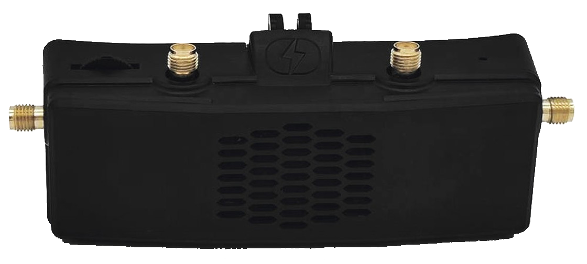
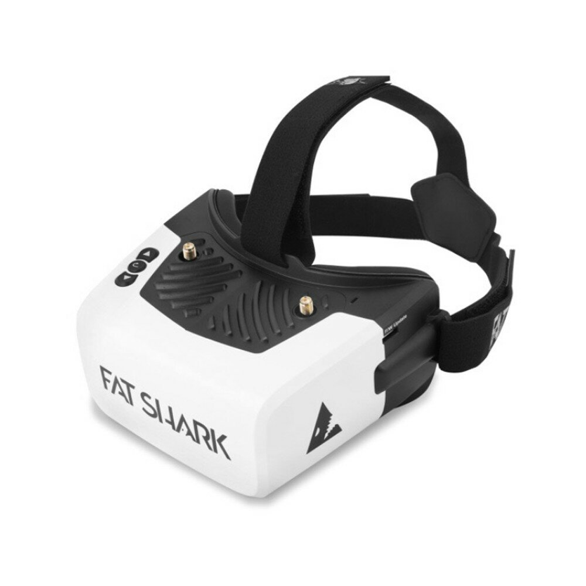
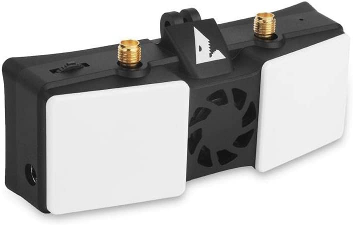

# Videosystem

Für die Auswahl einer Videobrille muss man sich bewusst machen, welche Systeme es gibt.

Die Auswahl des Videosystems bestimmt die Auswahl der FPV-Brille und der Videosender. Gerade die Brille ist mit der größte Kostenfaktor beim Einstieg. Für diesen Abschnitt kannst du zwischen 110€ für einen ganz rudimentären und 800€ für einen Premium-Setup einplanen.

## Allgemein

FPV unterscheidet sich von klassischem Modellbau-Flug dadurch, dass du von deinem Fluggerät das Live-Videobild an einen Empfänger überträgst und somit eine Art Pilotenansicht hast. Die Wiedergabe kann dabei auf einem Monitor oder einer Videobrille erfolgen. Wir konzentrieren uns im nachfolgenden auf den Empfang mittels Videobrille.

In der Videobrille hast du normalerweise einen Empfänger, entweder fest verbaut oder als Modul. Zudem hast du in der Brille die Möglichkeit, das angezeigte Bild auf SD-Karte aufzunehmen. Stichwort `DVR` (Digital Video Recorder). **NUTZE ES!** Die Bildqualität eignet sich eher nicht zum Angeben auf Youtube. Aber wenn du deine Drohne irgendwo auf weiter Flur verloren hast, wirst du die Möglichkeit zu schätzen wissen, dass du den Flug rekonstruieren kannst und weißt, wo das Gerät abgestürzt ist.

### Frequenz und Kanal

Die Videosender der nachfolgenden Systeme arbeiten alle auf 5.8GHz. Auf diesem Frequenzband funkt auch haushaltsübliches WLAN. Wenn du in der Nähe eines WLAN-Access-Punkts fliegst kann es sein, dass dieser dein Videosignal stört.

Je nach Funksystem gibt es mehrere Kanäle (Channel). Sender und Empfänger müssen auf den gleichen Kanal eingestellt sein. Die Kanäle sind in Gruppen eingeteilt. Die Kanäle der gleichen Gruppe können üblicherweise parallel verwendet werden, ohne dass sich diese zu stark negativ beeinträchtigen.

Wenn du vermutest, dass dein Videosignal von WLAN gestört wird, kann es sich lohnen den Kanal zu wechseln.

"R" (Raceband) ist die beliebteste Kanal-Gruppe für den Flug mit mehreren anderen Piloten. Wenn du zusammen mit anderen Piloten fliegst, solltet ihr vorab ausmachen, wer welchen Kanal verwendet und das auch **vor** dem Abheben verifizieren.

Beim Anschalten des Videosenders kann dieser auch auf anderen als den ausgewählten Frequenzen senden. Vermeide es daher, deinen Videosender in unmittelbarer Nähe von anderen Piloten einzuschalten.

Nicht alle einstellbaren Frequenzen sind in Europa legal. Welche legal geflogen werden dürfen, kannst der Grafik oben entnehmen.

### Sendeleistung

Die Sendeleistung wird üblicherweise in Milliwatt (mw) angegeben.

In Europa beträgt die maximal zulässige Sendeleistung 25mw. Es gibt auch Videosender, die ein vielfaches davon unterstützen, die meisten erhältlichen Sender unterstützen bis zu 200, 400, 600 oder 1000mw. Mehr Leistung heißt mehr Reichweite und besseres Bild auf größere Distanz. Um die Reichweite zu verdoppeln, musst du die Leistung vervierfachen.

Die Sendeleistung lässt sich herunter regeln, meistens erfolgt das über die Steuersoftware der Drohne.

Es obliegt dem Piloten, die gesetzlich vorgeschriebene Leistung einzuhalten.

> *Anm. rumpelst1lzk1n*: Sind wir mal ehrlich: Die wenigsten halten sich daran, insbesondere dann, wenn sie alleine unterwegs sind.

Je höher die Sendeleistung, desto höher strahlst du auch in benachbarte Frequenzen. Bei FPV-Rennen wird daher üblicherweise 25mw vorgeschrieben, damit sich die Piloten nicht gegenseitig beeinträchtigen. Daran hält man sich auch!

Betreibe den Videosender **NIEMALS** ohne Antenne. Andernfalls kann die Energie aus dem Sender nicht in Funkwellen umgesetzt werden und der Sender stirbt den Hitzetod. Bleibende Schäden an der Hardware bis hin zum vollständigen Defekt nicht ausgeschlossen.

### Antennen

Eine gute Antenne kann mehr zu einem stabilen Bild beitragen, als einfach die Leistung des Senders zu erhöhen.

Für den Einstieg sind auf Brille und Drohne ungerichtete Antennen vom Typ "Lollipop", "Stubby" oder "Pagoda" zu bevorzugen.

Wenn du an deiner Brille mehrere Inputs für Antennen hast und dein Videosystem z.B. Diversity unterstützt, kann eine Kombination aus gerichteter und ungerichteter Antenne Sinn machen. Dabei ist die Annahme, dass du meistens in dem Bereich vor dir fliegst. Für diesen Bereich sorgt dann die gerichtete Antenne für und da die Patch für den besseren Empfang sorgt.

#### Polarisation

Die Polarisation sagt etwas darüber aus, wie sich die Funkwellen aus der Antenne heraus ausbreiten bzw. auf den Empfang welcher Ausbreitungsform eine Antenne ausgelegt ist.

Dabei sind im FPV 3 unterschiedliche Polarisation üblich:

- Linear (oft auch als "Dipol" bezeichnet)
- RHCP (right hand circular polarized)
- LHCP (left hand circular polarized)

Wenn du auf einer Seite (z.B. des Senders) einen Dipol verwendest, ist es relativ egal, was du auf der anderen Seite (z.B. des Empfängers) hast. Linear und LHCP oder RHCP kann man relativ gut mischen.

Verwendest du auf beiden Seiten Antennen mir zirkularer Polarisation, so solltest du aufpassen, dass dies sowohl auf Sende- wie auch auf Empfangsseite der Fall ist. Also entweder nur `RHCP` oder nur `LHCP`.

#### Ungerichtet / Omnidirektional

Ungerichtete Antennen senden und empfangen (vereinfacht gesagt) in jede Richtung gleichmäßig.

Auf deinem Copter willst eigentlich immer eine omnidirektionale Antenne, da du dich mit dem Teil meistens rundherum im Kreis drehst.

Bei sehr kleinen und leichten Drohnen (TinyWhoops, siehe unten) kann aus Gewichtsgründen auch eine lineare Antenne Sinn machen.

| linear                                                                                                      | lollipop                                                                                           | stubby                                                                                           | pagoda                                                                                           |
| ----------------------------------------------------------------------------------------------------------- | -------------------------------------------------------------------------------------------------- | ------------------------------------------------------------------------------------------------ | ------------------------------------------------------------------------------------------------ |
|  |  |  |  |

#### Gerichtet

Gerichtete Antennen erkaufen sich einen besseren Empfang (höheren Gain) dadurch, dass sie sich auf einen bestimmten Empfangsbereich relativ zur Antenne beschränken. In diesem Bereich ist der Empfang besser als bei einer ungerichteten Antenne. In allen anderen Bereichen ist der Empfang dafür schlechter.

Die gängigste Bauform ist eine sog. Patch-Antenne. Dabei handelt es sich meistens nur um eine Platine, welche die Antenne bildet und einen Anschluss für deine Brille.

Helical findet sich auch vereinzelt als Bauform, wird aber eher für Flüge über längere Distanzen über mehrere Kilometer Entfernung verwendet.

| Patch                                                              | Helical                                                              |
| ------------------------------------------------------------------ | -------------------------------------------------------------------- |
|  |  |

#### SMA & RP-SMA

Ein gängiger Anschluss für Antennen ist SMA. Dabei gibt es SMA und RP-SMA. Beide unterscheiden sich dadurch, ob der Stift an der Schraube oder and der Mutter sitzt.

| Typ    | Schraube                                                                                                                    | Mutter                                                                                   |
| ------ | --------------------------------------------------------------------------------------------------------------------------- | ---------------------------------------------------------------------------------------- |
| SMA    |  |        |
| RP-SMA |                                    |  |

### OSD / On-Screen-Display

Oder auch: Alle Infos, die du über dein Fluggerät haben solltest. Das OSD zeigt dir diverse Daten aus deiner Flugsteuerung im Video deiner Brille an.

Häufig genutzte Werte sind z.B:

- Akku-Kapazität/-Spannung
- Empfangsqualität der Steuerungssignale
- **Warnmeldungen** (wann sollte ich landen, warum will mein Gerät nicht abheben, ...)
- GPS-Position
- Flugmodus

Vieles, was du anzeigen kannst, hängt davon ab, was deine Drohne verbaut hat und wie sie eingestellt ist.

Beispiele:

- Ohne GPS macht es keinen Sinn, sich die GPS Informationen anzeigen zu lassen.
- Ist die Strom-Messung am Flight-Controller falsch kalibriert, können dir die zugehörigen OSD-Elemente nicht automagisch richtige Werte liefern.
- Ist die minimale Zell-Spannung falsch eingestellt, werden dir Warnmeldungen über einen leeren Akku zu früh oder (schlimmer) zu spät ausgegeben.

Näheres dazu findest du normalerweise in der Anleitung deiner Software für die Flugsteuerung.

Die unterschiedlichen Videosysteme haben unterschiedliche Wege, wie sie dir Systeminformationen über dein Fluggerät anzeigen. Analog brennt das statisch ins Bild mit ein, bei digitalen Systemen wird das meistens über einen separaten Kanal übertragen und im Empfänger über das Bild gelegt. Das bringt den Vorteil mit sich, dass du bei manchen Systemen entscheiden kannst, ob du diese Informationen mit im DVR speichern willst oder eben nicht.

> *Anm. rumpelst1lzk1n*: Dieser Abschnitt ist einer besonderen Person gewidmet.

## Analog

Bis etwa Mitte 2019 die einzige Möglichkeit für FPV. Es gibt dutzende verschiedene Kameras, Videosender und Brillen von mehreren Herstellern. Alles untereinander kompatibel.

Die mit großem Abstand günstigste Möglichkeit, in FPV einzusteigen. Wenn dein Budget auf die oben erwähnten 500€ beschränkt ist, ist das hier deine Kategorie.

> *Anm. rumpelst1lzk1n*: Auch, wenn du mit dem Fliegen anfangen willst aber auf die Veröffentlichung/Verfügbarkeit eines bestimmten (digitalen) Videosystems wartest, kannst du mit einem analogen Budget-Setup einsteigen, ohne allzu viel Geld zu verbrennen.

Brille 80€, Videosender 10€, Kamera 15€ wäre so ein Minimal-Setup.

Neben dem Geld ist auch noch das Gewicht ein Argument für einen Analog-Setup. Die leichtesten anlogen Videosender wiegen circa 1 Gramm.

### Videosender (Analog)

Es gibt eine Vielzahl unterschiedlicher Videosendern von unterschiedlichen Herstellern.

Üblich sind zwischen 200mw und 600mw maximaler Sendeleistung.
Es gibt noch deutlich stärkere Sender bis hoch zu 2000mw, diese sind aber erst für wirklich große Distanzen relevant.

Der Vorteil bei analogen Systemen ist, dass du die unterschiedlichen Videosender leicht gegeneinander austauschen kannst.

Besonders hervorzuheben sind die Videosender der Unify-Reihe von TBS und die ImmersionRC Tramp. Sie gelten mit als die Besten. Auf Rennen sind oft nur diese Analog-VTX zugelassen.

Für den Anfang tut es eigentlich jeder analoge VTX, aber spätestens wenn du mit anderen fliegst, willst du einen halbwegs guten. Manche No-Name-VTX haben ein sehr "unsauberes" Signal und streuen auch über den eigentlich eingestellten Kanal hinaus in andere Frequenzen.

Wenn das Budget wirklich knapp ist und du den billigsten VTX willst, achte zumindest darauf, dass dieser mit [OpenVTX](https://github.com/OpenVTx/OpenVTx) als Firmware beworben wird.

### Brille

Bei den Analog-Brillen gibt es die größte Varianz in Sachen Preis. Es gibt Brillen für ~40€ und für 600€.

Man unterscheidet bei den Brillen zwischen Box- und Binocular-Style.

| Box                                                                                 | Binocular                                      |
| ----------------------------------------------------------------------------------- | ---------------------------------------------- |
|  |  |

#### Box-Style

Box-Style ist einfach nur eine Box, die vor dem Gesicht hängt. Je nach Bauform mehr oder weniger unförmig. Die Box ein Display und ggf noch eine Linse.

Vorteile:

- günstiger
- leichter mit Brille nutzbar

In dieser Kategorie bekommst du ab ca ~80€ eine halbwegs taugliche Einsteigerbrille.

#### Binocular-Style

Beim Binocular-Style hast du ein Display pro Auge. Brillen in dieser Bauform sind deutlich kompakter aber auch deutlich teurer.

Eine Brille für die Sehstärke passt da eher selten drunter. Dafür kannst du oft den Augenabstand und die Dioptrien in der Optik der Brille direkt einstellen.

Vorteile:

- kleiner/leichter
- Optik pro Auge anpassbar

In dieser Kategorie bekommst du ab ca ~350€ eine halbwegs taugliche Brille. Lass dich nicht täuschen, es gibt günstigere Brillen im Binocular-Style. Die sind Müll.

#### Empfehlungen (Analog-Brillen)

Schau dich auf dem Gebrauchtmarkt um. Viele der unten genannten Modelle kriegst du auf eBay-Kleinanzeigen recht günstig gebraucht.

Wenn du mehr als 200€ für die Brille ausgibst, sollte diese über einen HDMI-Eingang verfügen um zukunftssicher für HD-Systeme zu sein (siehe unten).

##### Eachine EV800D

Empfehlung des Hauses als absolute Einsteiger-Brille, für die es sich lohnt, Geld auszugeben.

- ca. 100€
- DVR
- Antennen-Diversity
- wird mit einer Patch-Antenne und einer omnidirektionalen Antenne geliefert
- integrierter Receiver mit Diversity, was in dieser Preisklasse nicht selbstverständlich ist

##### Skyzone Cobra X (v2)

- ca. 250€
- gutes DVR, 60FPS (ab V2, V1 hat nur 30FPS DVR)
- Auflösung 720p
- gutes eingebautes Receiver-Modul
- HDMI-in

Es gibt noch günstigere Versionen dieser Brille unter der Marke Eachine. Diese haben Displays mit deutlich geringerer Auflösung.

##### Fatshark Attitude V6

- ca 350-400€
- DVR
- Auflösung 720p
- integrierter Receiver
- HDMI-in

Fatshark konzentriert sich zunehmend auf den digitalen Markt. Wie viel Zukunft ihre analogen Produkte noch haben ist zur Zeit fraglich.

##### Fatshark Dominator HDO 2

- ca. 600€
- DVR
- Auflösung 720p
- **KEIN** mitgelieferter Receiver
- HDMI-in
- OLED-Display (knackscharfe Farben)

Auf dem Gebrauchtmarkt gibt es öfter auch Pakete mit Receiver.

> *Anm. rumpelst1lzk1n*: Ich würde mir von Fatshark kein analoges System mehr neu kaufen ...

##### Skyzone Sky04X (v2)

- ca. 600€
- gutes DVR, 60FPS (ab V2, V1 hat nur 30FPS DVR)
- Auflösung 720p
- gutes mitgeliefertes Receiver-Modul
- HDMI-in
- OLED-Display (knackscharfe Farben)

> *Anm. rumpelst1lzk1n*: In meiner Wahrnehmung die beste analoge Brille.

### Empfänger (Analog)

Manche Brillen kommen ohne Empfänger. Hier musst du diesen über einen Modulschacht nachrüsten.

Falls du dich für so eine Brille entschieden hast, hier eine Liste populärer Empfänger:

- TBS Fusion (siehe Artikel zu TBS Crossfire/TBS Tracer)
- Rapidfire
- FuriousFPV Achilles

Ein Empfänger sollte ähnlich wie eine Brille mit eingebautem Modul mindestens über 2 Antennen verfügen. Damit kann sich der Empfänger das beste Signal heraus picken (`Diversity`). Fortgeschrittene Module wie TBS Fusion oder Rapidfire können das Signal beider Antennen kombinieren und ein optimales Bildsignal herausrechnen.

## DJI

DJI ist das Apple unter den FPV-Systemen. Funktioniert super, ist aber ein goldener Käfig. Kameras gibt es von 2 Herstellern. Es gibt 2 Brillen und 2 Videosender von DJI.

> *Anm. remove_me*: Das Bild ist dafür auch circa 10x geiler und kommt so in etwa bei 720p raus.

Das System hat einen sehr guten Reifegrad. Wenn du das Geld übrig, kein Problem mit einem goldenen Käfig ala Apple hast und zudem auch nur so zum Spaße (also keine Rennen) fliegen willst, gibt es keinen Grund, nicht auf das DJI-System zu setzen.
Viele fliegen dennoch Rennen mit dem DJI-System, wenn es vom Rennveranstalter erlaubt ist.

Es gibt Anzeichen dafür, dass DJI das System weiterentwickelt. Ob diese Weiterentwicklung mit der aktuell verfügbaren Hardware kompatibel sein wird, oder ob DJI ein neues System auf den Markt bringt, ist bisher noch nicht bekannt.

Zudem wurde die Firmware des Systems [inzwischen geknackt](https://github.com/fpv-wtf/margerine), was auf eine Weiterentwicklung des Systems durch die Community hoffen lässt.

### Brillen

Bei den Brillen unterscheidet man zwischen V1 und V2. V2 hat eine höhere Refreshrate der Bildschirme, 120Hz vs 144Hz. Darüber hinaus ist V2 nur relevant, wenn du die DJI-FPV-Drohne fliegen willst. Sonst tut es V1 auch.

Die DJI-FPV-Drohne ist eine glorifizierte Mavic-Drohne, die man besser nicht crasht. Wo du klassische FPV-Drohne gegen Bäume donnern und (falls überhaupt mal etwas kaputt geht) selbst reparieren kannst, ist die DJI-FPV-Drohne ein Plastikbomber, den du für teuer Geld zu DJI in die Reparatur schicken musst.

> *Anm. remove_me*: Scheiß auf die!

Für das FPV, auf das wir uns hier in diesem Guide konzentrieren ist es also egal, ob du die Brille v1 oder v2 kaufst.

|  |
| ---------------------------------------------------------------------------------------------------------------------------------------------- |
| DJI FPV Brille                                                                                                                                 |

Das DVR der Brille kann man auch schon ganz gut zum Herumzeigen verwenden.

Es gibt auch Adapter, um ein Receiver-Modul (siehe oben) mit der DJI-Brille zu verwenden, wenn du neben Digital auch noch Analog fliegen möchtest.

### Videosender (DJI)

Als Videosender gibt es die AirUnit und die Vista Unit. Die AirUnit ist größer und schwerer, hat aber einen SD-Kartenslot, auf dem das Videomaterial zusätzlich zum DVR in der Brille aufgezeichnet werden kann. Leider funktioniert die Videoaufzeichnung auf der AirUnit so unzuverlässig, dass man es auch sein lassen kann. Die Vista Unit ist zu bevorzugen und passt auch leichter in die meisten Frames.

| AirUnit                                                                                     | Vista Unit                                                                                                                |
| ------------------------------------------------------------------------------------------- | ------------------------------------------------------------------------------------------------------------------------- |
|  |  |

Der Videosender kann auch gleichzeitig als Funkempfänger für eine DJI-Funkfernsteuerung benutzt werden. Eigentlich willst du eine echte Funkfernsteuerung, siehe oben.

### Kamera (DJI)

Bei den verfügbaren Kameras gibt es vorrangig die Auswahl zwischen Kameras mit 60FPS und Kameras mit 120FPS. Du willst eine Kamera mit 120FPS.

- DJI Air Unit Cam
- Caddx Vista Unit Cam
- Caddx Nebula **Pro** (nano)

Alle andern Kameras sind irrelevant. Bestenfalls zählt die Caddx Polar noch als Notnagel.

## HDZero (früher SharkByte)

HDZero (aka SharkByte) ist ein weiteres digitales FPV-System, das im Gegensatz zu DJI noch keine so weite Verbreitung genießt. Das Projekt wurde ursprünglich unter dem Namen SharkByte unter der Schirmherrschaft von FatShark entwickelt. Inzwischen hat sich die Firma Divimath hinter der Technologie aber von FatShark abgenabelt und neue Produkte entstehen unabhängig von FatShark.

Bei der Bildqualität ist DJI klar das bessere System.

Für die Nutzung von HDZero gibt es normal folgende Gründe:

- Du willst kein DJI aber trotzdem besseres Bild als Analog.
- Du bist Racer und willst Digital aber
  - das DJI-System wiegt dir zu viel.
  - die variable Latenz anderer digitaler Systeme stört dich.
- Du hast bereits eine gute Analog-Brille (mit HDMI-Eingang) und möchtest diese weiter verwenden.

Das System kann inzwischen (Mitte 2022) als relativ ausgereift betrachtet werden.

Es wird langsam von Drittherstellern adaptiert, die eigene Kameras und Video-Sender herausbringen. Im Gegensatz zu DJI will die Firma hinter HDZero die Technologie auch anderen Herstellern zugänglich machen, sodass diese eigene, untereinander kompatible Produkte auf den Markt bringen können. Ähnlich, wie es jetzt auch schon bei Analog der Fall ist.

### Videosender (HDZero)

Aktuell gibt es 3 relevante Videosender.

| Race V2 (20x20)                                                                                                                                                             | Whoop (25x25)                                                                                                                                                              | Freestyle (30x30)                                                      |
| --------------------------------------------------------------------------------------------------------------------------------------------------------------------------- | -------------------------------------------------------------------------------------------------------------------------------------------------------------------------- | ---------------------------------------------------------------------- |
|  |  |  |

Der Freestyle Sender hat bis zu einem Watt Sendeleistung. Alle anderen bis zu 200 Milliwatt. Bitte beachte, dass in Deutschland maximal 25 Milliwatt legal sind.

### Empfänger (HDZero)

Für HDZero gibt es einen Empfänger, der etwa 250€ kostet. Dieser setzt eine vorhandene FPV-Brille **mit HDMI-Eingang** voraus.

Eine neue Brille mit nativer HDZero-Unterstützung befindet sich aktuell in der Entwicklung, diese wird aber voraussichtlich nicht vor Ende 2022 verfügbar sein.

### Alte Hardware

Neben den oben erwähnten Empfängern und Sendern gibt es noch ältere Hardware. Diese wurde teilweise unter dem Label von Fatshark vermarktet. Seit Fatshark und HDZero getrennte Wege gehen, wird diese Hardware nicht mehr weiter produziert.

Zu der betreffenden Hardware zählen Videosender in teilweise etwas unüblichen Formfaktoren.

Daneben gibt es noch Legacy-Empfangs-Hardware. Eine Brille mit eingebautem HDZero-Modul und ein separates Modul. Das Modul wurde nahtlos durch den oben bereits genannten Empfänger ersetzt. Für die Brille gibt es bisher noch keine Alternative.

| Fatshark Scout HD                                          | SharkByte Empfänger                                            |
| ---------------------------------------------------------- | -------------------------------------------------------------- |
|  |  |

## Walksnail

Seit Anfang Juli ist ein neues System von Fatshark/Walksnail erhältlich.

Das System verhält sich ähnlich wie DJI, ist aber nicht damit kompatibel.

Um das Vorgehen der Veröffentlichung gab es größere Kontroversen:

- Seitens der offiziellen Hersteller (Fatshark) wurde viel Geheimniskrämerei darum betreiben, wer hinter dem System steht.
- Viele Informationen sind aufgrund von unprofessionellen bzw. nicht vorhandenen Absprachen mit Händlern und Herstellern trotzdem sehr schnell ans Licht gekommen.
- Die Community wurde mit Anmerkungen, dass sie diverse Infos nichts angingen, verärgert.

> *Anm. Drew "Le Drib" Camden*: You don't get to know.

- Der Ursprung der Hardware ist nicht klar bzw. gibt es Hinweise darauf, dass dieser aktiv verschleiert werden sollte.
- Das System wurde mit unfertiger Software ausgeliefert.

> *Anm. rumpelst1lzk1n*: Einem Anfänger würde ich noch davon abraten. Das System sollte sich mindestens 1-2 Monate auf dem Markt befunden haben, einmal durch die Hände der größeren Reviewer gegangen sein und der Hersteller sollte das erste Community-Feedback in die Firmware haben einfließen lassen.

Die Hardware-Auswahl ist überschaubar, es gibt:

- 2 Brillen
- einen VTX (Formfaktor 25,6x25,6)
- 2 Kameras (Formfaktor micro und nano)

| Sender                                                      | Brille (Walksnail)                                       | Brille (Fatshark)                                          |
| ----------------------------------------------------------- | -------------------------------------------------------- | ---------------------------------------------------------- |
|  |  |  |

Die beiden Brillen unterscheiden sich nur durch die Farbe der Hülle. Nimm die, die dir besser gefällt oder die du günstiger bekommst.

Beide Brillen vertragen entgegen früherer Annahmen nur **5S**. Schließe sie nicht direkt an den üblichen 6S Drohnenakku an!!!

## HD Aufnahmen

Wer wirklich gutes Bildmaterial von seinem Flug haben will, packt eine Action-Cam auf die Drohne.

Am verbreitetsten sind die unterschiedlichen Modelle der GoPro Hero-Reihe.

Andere populäre HD-Kameras sind:

- GoPro Session
- Insta360 Go(2)
- Runcam Orange

## unter ferner liefen

### Orqa HD

Orqa hat auf der CES 2022 ein eigenes HD-Videosystem vorgestellt. Viel ist darüber noch nicht bekannt.

Der Videoempfänger soll wohl ein Modul ähnlich dem von HDZero werden. An FPV-Brillen kann dieser dann entweder mit HDMI oder einer proprietären Schnittstelle angeschlossen werden.

Zum aktuellen Zeitpunkt (Anfang 2022) ist davon auszugehen, dass es wohl noch mindestens 1-2 Jahre dauern wird, bis die ersten Produkte tatsächlich auf den Markt kommen.

### OpenHD

[OpenHD](https://github.com/OpenHD/Open.HD) ist ein OpenSource-Projekt, in dem handelsübliche WLAN-Hardware zur Bildübertragung genutzt wird. Das Projekt wird aktiv weiter entwickelt. Für den FPV-Flug mit Drohne ist diese Art der Videoübertragung leider (noch) nicht zu gebrauchen, da die Latenz zu hoch ist.
